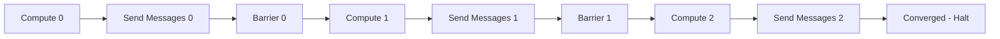
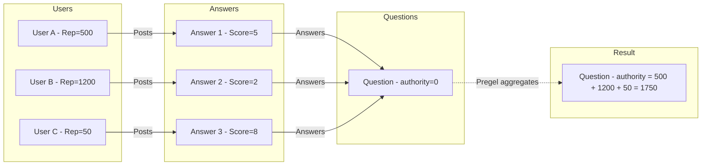

# Think Like a Vertex: A Deep Dive into Graph Algorithms with GraphFrames Pregel

*How a 15-year-old Google paper became the key to scaling custom graph algorithms on Apache Spark*

---

If you've ever tried to compute something over a graph that goes beyond simple neighbor lookups — PageRank, shortest paths, influence propagation, custom centrality metrics — you've probably hit the wall where SQL joins get exponentially expensive and graph databases run out of memory. There's a better way, and it's been hiding in plain sight since 2010.

**Pregel** is a vertex-centric programming model for distributed graph processing, introduced by engineers at Google in their landmark SIGMOD 2010 paper. The core idea is beautifully simple: instead of writing an algorithm that operates on the entire graph, you write a function that runs at each vertex independently. Vertices communicate by passing messages along edges. The system handles distribution, synchronization, and fault tolerance.

GraphFrames — the open-source graph processing library for Apache Spark — implements Pregel using DataFrames, giving you the full power of Spark's optimizer behind a clean, declarative API. Today I'm excited to share a comprehensive new tutorial that teaches you to think in Pregel and implement custom graph algorithms at scale.

## Why Should You Care?

Graph databases like Neo4j are great for queries: "find me all friends of friends who live in San Francisco." But what about computations that require *iterative convergence* — where the answer depends on the answer, recursively?

- **PageRank**: A node's importance depends on the importance of nodes pointing to it
- **Connected components**: A node's component label depends on its neighbors' labels
- **Shortest paths**: A node's distance depends on its neighbors' distances
- **Influence propagation**: How does trust or reputation flow through a network?

These are fundamentally iterative problems. They require multiple rounds of computation where vertex states evolve based on neighbor states. Graph databases require you to write external loops and manage intermediate state manually. SQL solutions require self-joins that grow quadratically with hop count. Pregel handles all of this natively.

## The BSP Model in 30 Seconds

Pregel uses the **Bulk Synchronous Parallel** (BSP) model. Computation proceeds in supersteps:

1. **Compute**: Every vertex reads its incoming messages and updates its state
2. **Communicate**: Every vertex sends messages to its neighbors
3. **Barrier**: Everyone waits until all vertices finish before the next round



The barrier synchronization eliminates race conditions and makes algorithms easy to reason about. No distributed coordination headaches. No stale reads. Just clean, parallel computation.

## GraphFrames Makes It Declarative

Here's what PageRank looks like in GraphFrames Pregel — 8 lines of code:

```python
from graphframes.lib import Pregel

results = graph.pregel \
    .setMaxIter(10) \
    .withVertexColumn("pagerank", F.lit(1.0 / N),
        F.coalesce(Pregel.msg(), F.lit(0.0)) * 0.85 + 0.15 / N) \
    .sendMsgToDst(Pregel.src("pagerank") / Pregel.src("out_degree")) \
    .aggMsgs(F.sum(Pregel.msg())) \
    .run()
```

That's it. Eight lines to implement the algorithm that powered Google Search. Every expression is a standard Spark SQL column expression — no custom serializers, no vertex programs in Java, no RDD manipulations. The Catalyst optimizer handles the rest.

## Custom Algorithms: Where Pregel Shines

The real power of Pregel isn't reimplementing PageRank — GraphFrames already has that built in. It's implementing algorithms that *don't exist* in any library.

In our tutorial, we build a **reputation propagation** algorithm for Stack Exchange data. Users have reputation scores. They post answers to questions. We want to compute an "authority score" for each question based on the collective reputation of its answerers.

This requires information to flow two hops: User → Answer → Question. Each hop aggregates differently. With Pregel, it's straightforward:

```python
rep_results = rep_graph.pregel \
    .setMaxIter(2) \
    .withVertexColumn("authority", F.col("reputation"),
        F.coalesce(Pregel.msg(), F.lit(0.0)) + F.col("authority")) \
    .sendMsgToDst(F.when(Pregel.src("authority") > 0, Pregel.src("authority"))) \
    .aggMsgs(F.sum(Pregel.msg())) \
    .run()
```



The questions with the highest authority are those answered by the most reputable community members. You could extend this to three hops (reputation flows to questions, then to tags) or add weighting by answer scores. Each extension is just one more `setMaxIter` increment.

## From Theory to Practice: Connected Components

Another algorithm that demonstrates Pregel's elegance is connected components — finding groups of vertices that are reachable from each other. The algorithm is simple: each vertex starts with its own ID as a label, then repeatedly adopts the minimum label among its neighbors. After a few rounds, every vertex in the same connected component shares the same label.

In our Stack Exchange graph, this reveals the network structure: one giant component (most users, questions, and answers are interconnected through the Q&A chain) plus thousands of tiny components (orphaned votes, isolated badges). The giant component represents the core community, while the small components are the edges of the network — data that hasn't been fully integrated.

What makes this interesting in practice is that connected components is often the *first* algorithm you run on a new graph. It tells you whether your graph is one connected piece or many disconnected pieces, which affects every subsequent analysis. If you're building a knowledge graph for entity resolution, disconnected components might represent distinct real-world entities. If you're analyzing a social network, small components might indicate data quality issues.

## What's in the Tutorial

The [full tutorial](https://graphframes.io/03-tutorials/04-pregel-tutorial.html) covers seven progressive examples:

1. **In-degree with AggregateMessages** — single-pass baseline
2. **In-degree with Pregel** — same algorithm, learn the API
3. **PageRank** — multi-iteration convergence
4. **Connected Components** — bidirectional label propagation
5. **Shortest Paths** — BFS with early stopping
6. **Reputation Propagation** — custom multi-hop algorithm
7. **Debug Trace** — see exactly how messages flow

Each example includes a Mermaid diagram showing the algorithm's execution, complete runnable code, and interpretation of the results on real Stack Exchange data. We also cover advanced topics: convergence strategies, memory optimization, performance best practices, and a systematic framework for designing your own Pregel algorithms.

## Get Started

Install `graphframes-py` from PyPI:

```bash
pip install "graphframes-py[tutorials]>=0.10.1"
```

The tutorial uses the `stats.meta.stackexchange.com` dataset — small enough to run on a laptop, complex enough to demonstrate real algorithms. The complete source code is available in the [GraphFrames repository](https://github.com/graphframes/graphframes/blob/master/python/graphframes/tutorials/pregel.py).

If you've been meaning to learn graph algorithms but found the theory impenetrable, this tutorial is for you. If you're already building graph pipelines but hitting scalability walls, Pregel on GraphFrames is the path forward. And if you just want to compute something cool on a knowledge graph this weekend — we've got seven examples ready to run.

The tutorial is designed to be progressive. Start with the simple in-degree examples to learn the API, then work through PageRank to understand multi-iteration convergence, and by the time you reach reputation propagation, you'll have the mental framework to design your own algorithms. We even include a "debug trace" example that makes Pregel's internal message-passing mechanics visible — invaluable when you're developing something new and the results don't look right.

The Stack Exchange dataset is perfect for learning because it's small (runs on a laptop in minutes) but structurally rich (7 node types, 8 edge types, real community dynamics). Every algorithm produces results you can interpret and validate against your intuition about how Q&A communities work.

I've been working on GraphFrames for a while now, and Pregel is the feature I'm most excited about sharing. It takes an academic concept — bulk synchronous parallel processing — and makes it accessible to any engineer who knows Python and Spark. The DataFrame-based API means you don't need to learn a new programming paradigm; you just write SQL-like expressions that happen to execute in a distributed, iterative, vertex-centric fashion. That's the magic of building on Spark's foundation.

The graph computing space is evolving rapidly. Knowledge graphs are becoming central to AI systems. Entity resolution, recommendation engines, fraud detection, drug discovery — all of these are graph problems at their core. Having a scalable, open-source framework for custom graph algorithms isn't just nice to have; it's essential infrastructure. GraphFrames' Pregel API provides exactly that foundation.

**Think like a vertex. Scale like Spark.**

---

*Russell Jurney is a maintainer of [GraphFrames](https://graphframes.io), an Apache Software Foundation committer, and founder of [Graphlet AI](https://graphlet.ai). He builds entity-resolved knowledge graphs and graph ML systems.*

*Follow [Graphlet AI on Substack](https://graphletai.substack.com) for more graph computing content.*
