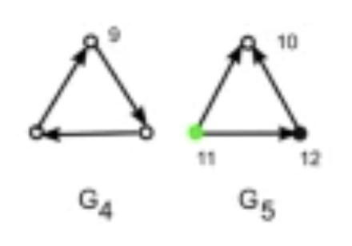
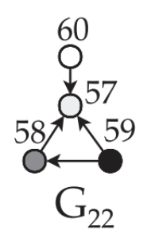
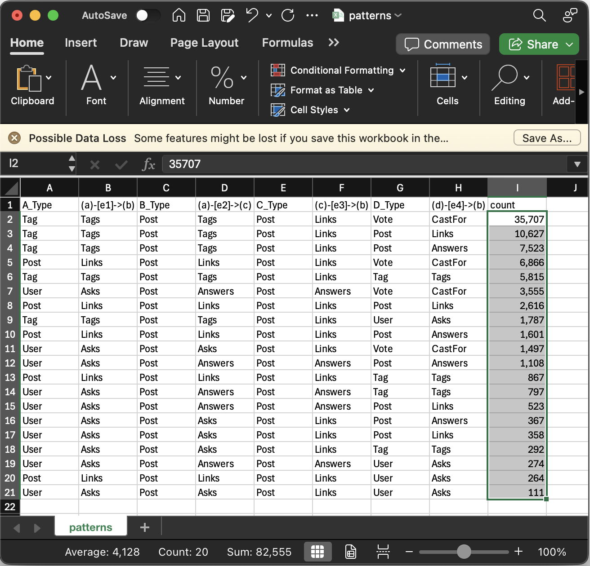
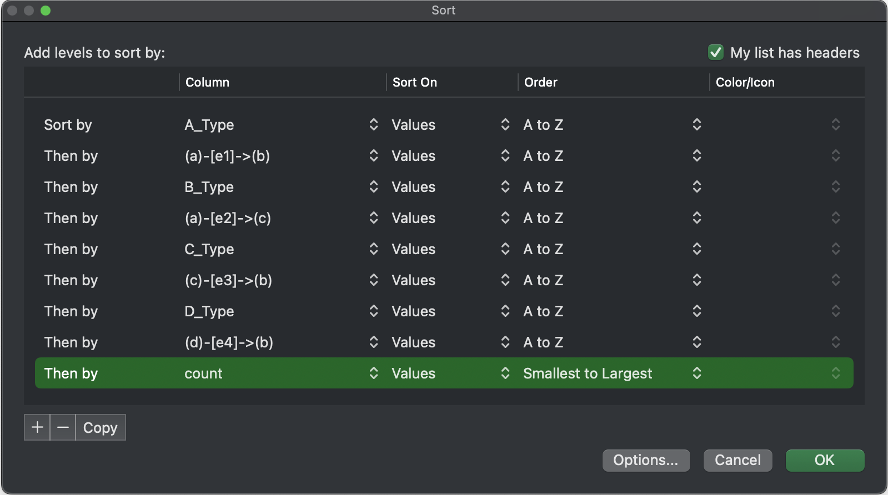
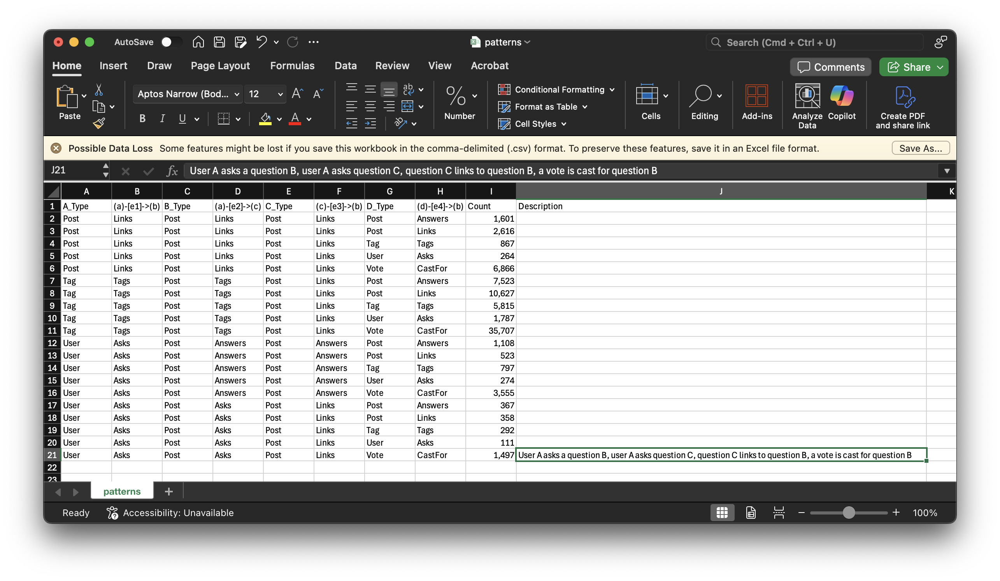

This tutorial covers GraphFrames' motif finding feature. We perform pattern matching on a property graph representing a Stack Exchange site using Apache Spark and [GraphFrames' motif finding](user-guide.html#motif-finding) feature. We will download the `stats.meta` archive from the [Stack Exchange Data Dump at the Internet Archive](https://archive.org/details/stackexchange), use PySpark to build a property graph and then mine it for property graph network motifs by combining both graph and relational queries.

* Table of contents (This text will be scraped.)
  {:toc}

# What are graphlets and network motifs?

Graphlets are small, connected subgraphs of a larger graph. Network motifs are recurring patterns in complex networks that are significantly more frequent than in random networks. They are the building blocks of complex networks and can be used to understand the structure and function of networks. Network motifs can be used to identify functional modules in biological networks, detect anomalies in social networks, detect money laundering and terrorism financing in financial networks, and predict the behavior of complex systems.

    <figure>
        
        <figcaption><a href="https://www.dcc.fc.up.pt/~pribeiro/pubs/pdf/aparicio-tcbb2017.pdf">Extending the Applicability of
Graphlets to Directed Networks, Aparicio et al. 2017</a></figcaption>
    </figure>

We are going to mine motifs using Stack Exchange data. The Stack Exchange network is a complex network of users, posts, votes, badges, and tags. We will use GraphFrames to build a property graph from the Stack Exchange data dump and then use GraphFrames' motif finding feature to find network motifs in the graph. You'll see how to combine graph and relational queries to find complex patterns in the graph.

# Download the Stack Exchange Dump for [stats.meta](https://stats.meta.stackexchange.com)

The Python tutorials include a CLI utility at [`python/graphframes/tutorials/download.py`](python/graphframes/tutorials/download.py) for downloading any site's [Stack Exchange Data Dump](https://archive.org/details/stackexchange) from the Internet Archive. The script takes the subdomain as an argument, downloads the corresponding 7zip archive and expands it into the `python/graphframes/tutorials/data` folder.


Usage: download.py [OPTIONS] SUBDOMAIN

  Download Stack Exchange archive for a given SUBDOMAIN.

  Example: python/graphframes/tutorials/download.py stats.meta

  Note: This won't work for stackoverflow.com archives due to size.

Options:
  --data-dir TEXT           Directory to store downloaded files
  --extract / --no-extract  Whether to extract the archive after download
  --help                    Show this message and exit.


Use `download.py` to download the Stack Exchange Data Dump for `stats.meta.stackexchange.com`.


$ python python/graphframes/tutorials/download.py stats.meta

Downloading archive from <https://archive.org/download/stackexchange/stats.meta.stackexchange.com.7z>
Downloading  [####################################]  100%
Download complete: python/graphframes/tutorials/data/stats.meta.stackexchange.com.7z
Extracting archive...
Extraction complete: stats.meta.stackexchange.com


# Build the Graph

We will build a property graph from the Stack Exchange data dump using PySpark in the [python/graphframes/tutorials/stackexchange.py](python/graphframes/tutorials/stackexchange.py) script. The data comes as a single XML file, so we use [spark-xml](https://github.com/databricks/spark-xml) (moving inside Spark as of 4.0) to load the data, extract the relevant fields and build the nodes and edges of the graph. For some reason Spark XML uses a lot of RAM, so we need to increase the driver and executor memory to at least 4GB.


$ spark-submit --packages com.databricks:spark-xml_2.12:0.18.0 --driver-memory 4g --executor-memory 4g python/graphframes/tutorials/stackexchange.py


The script will output the nodes and edges of the graph in the `python/graphframes/tutorials/data` folder. We can now use GraphFrames to load the graph and perform motif finding.

# Motif Finding

We will use GraphFrames to find motifs in the Stack Exchange property graph. The script [python/graphframes/tutorials/motif.py](python/graphframes/tutorials/motif.py) demonstrates how to load the graph, define various motifs and find all instances of the motif in the graph.

NOTE: I use the terms `node` as interchangaable with `vertex` and `edge` with `link` or `relationship`. The API is [GraphFrame.vertices](https://graphframes.github.io/graphframes/docs/_site/api/python/graphframes.html#graphframes.GraphFrame.vertices) and [GraphFrames.edges](https://graphframes.github.io/graphframes/docs/_site/api/python/graphframes.html#graphframes.GraphFrame.edges) but some documentation says `relationships`. We need to add an alias from `g.vertices` to `g.nodes` and `g.edges` to both `g.relationships` and `g.links`.

For a quick run-through of the script, use the following command:


spark-submit --packages com.databricks:spark-xml_2.12:0.18.0 python/graphframes/tutorials/stackexchange.py


Let's walk through what it does, line-by-line. The script starts by importing the necessary modules and defining some utility functions for visualizing paths returned by [g.find()](https://graphframes.github.io/graphframes/docs/_site/user-guide.html#motif-finding). Note that if you give `python/graphframes/tutorials/download.py` CLI a different subdomain, you will need to change the `STACKEXCHANGE_SITE` variable.


import pyspark.sql.functions as F
from graphframes import GraphFrame
from pyspark import SparkContext
from pyspark.sql import DataFrame, SparkSession

# Initialize a SparkSession
spark: SparkSession = (
    SparkSession.builder.appName("Stack Overflow Motif Analysis")
    # Lets the Id:(Stack Overflow int) and id:(GraphFrames ULID) coexist
    .config("spark.sql.caseSensitive", True)
    .getOrCreate()
)
sc: SparkContext = spark.sparkContext
sc.setCheckpointDir("/tmp/graphframes-checkpoints")

# Change me if you download a different stackexchange site
STACKEXCHANGE_SITE = "stats.meta.stackexchange.com"
BASE_PATH = f"python/graphframes/tutorials/data/{STACKEXCHANGE_SITE}"


Load the nodes and edges of the graph from the `data` folder and count the types of node and edge. We repartition the nodes and edges to give our motif searches parallelism. GraphFrames likes nodes/vertices and edges/relatonships to be cached.


#
# Load the nodes and edges from disk, repartition, checkpoint [plan got long for some reason] and cache. 
#

# We created these in stackexchange.py from Stack Exchange data dump XML files
NODES_PATH: str = f"{BASE_PATH}/Nodes.parquet"
nodes_df: DataFrame = spark.read.parquet(NODES_PATH)

# Repartition the nodes to give our motif searches parallelism
nodes_df = nodes_df.repartition(50).checkpoint().cache()

# We created these in stackexchange.py from Stack Exchange data dump XML files
EDGES_PATH: str = f"{BASE_PATH}/Edges.parquet"
edges_df: DataFrame = spark.read.parquet(EDGES_PATH)

# Repartition the edges to give our motif searches parallelism
edges_df = edges_df.repartition(50).checkpoint().cache()


Check out the node types we have to work with:


# What kind of nodes we do we have to work with?
node_counts = (
    nodes_df
    .select("id", F.col("Type").alias("Node Type"))
    .groupBy("Node Type")
    .count()
    .orderBy(F.col("count").desc())
    # Add a comma formatted column for display
    .withColumn("count", F.format_number(F.col("count"), 0))
)
node_counts.show()



+---------+------+
|Node Type| count|
+---------+------+
|    Badge|43,029|
|     Vote|42,593|
|     User|37,709|
|     Post| 5,003|
|PostLinks| 1,274|
|      Tag|   143|
+---------+------+


Check out the edge types we have to work with:


# What kind of edges do we have to work with?
edge_counts = (
    edges_df
    .select("src", "dst", F.col("relationship").alias("Edge Type"))
    .groupBy("Edge Type")
    .count()
    .orderBy(F.col("count").desc())
    # Add a comma formatted column for display
    .withColumn("count", F.format_number(F.col("count"), 0))
)
edge_counts.show()



+---------+------+
|Edge Type| count|
+---------+------+
|    Earns|43,029|
|  CastFor|40,701|
|  Answers| 5,745|
|     Tags| 4,427|
|     Asks| 1,934|
|    Links| 1,268|
+---------+------+


<h2 id="combine-node-types">Combining Node Types</h2>

<b>Note: you don't need to run the code in this section, it is just for reference. The data we loaded above is already prepared for use.</b> Jump ahead to <a href="#creating-graphframes">Creating GraphFrames</a> and run that next :)

At the moment, GraphFrames has a limitation: <i>there is only one node and edge type (for now).</i> There are many fields in the nodes of our `GraphFrame` because there only one node type is available. I have combined different types of node into a single type by including all properties of all types in one class of node. I created a `Type` field for each type of node, then merged all fields into a single, global `nodes_df` `DataFrame`. This `Type` column can then be used in relational [DataFrame](https://spark.apache.org/docs/latest/api/python/reference/pyspark.sql/dataframe.html) operations to distinguish between types of nodes.

This limitation is an annoyance that should be fixed in the future, with the ability to have multiple node types in a `GraphFrame`. In practice it isn't a big hit in productivity, but it means you have to [DataFrame.select](https://spark.apache.org/docs/latest/api/python/reference/pyspark.sql/api/pyspark.sql.DataFrame.select.html) certain columns for each node `Type` when you do a [DataFrame.show()](https://spark.apache.org/docs/latest/api/python/reference/pyspark.sql/api/pyspark.sql.DataFrame.show.html) or the width of the DataFrame will be too wide to easily read.

Here is how that was accomplished in <a href="https://github.com/graphframes/graphframes/blob/master/python/graphframes/tutorials/stackexchange.py">python/graphframes/tutorials/stackexchange.py</a>.


#
# Form the nodes from the UNION of posts, users, votes and their combined schemas
#

all_cols: List[Tuple[str, T.StructField]] = list(
    set(
        list(zip(posts_df.columns, posts_df.schema))
        + list(zip(post_links_df.columns, post_links_df.schema))
        + list(zip(comments_df.columns, comments_df.schema))
        + list(zip(users_df.columns, users_df.schema))
        + list(zip(votes_df.columns, votes_df.schema))
        + list(zip(tags_df.columns, tags_df.schema))
        + list(zip(badges_df.columns, badges_df.schema))
    )
)
all_column_names: List[str] = sorted([x[0] for x in all_cols])

def add_missing_columns(df: DataFrame, all_cols: List[Tuple[str, T.StructField]]) -> DataFrame:
    """Add any missing columns from any DataFrame among several we want to merge."""
    for col_name, schema_field in all_cols:
        if col_name not in df.columns:
            df = df.withColumn(col_name, F.lit(None).cast(schema_field.dataType))
    return df

# Now apply this function to each of your DataFrames to get a consistent schema
posts_df = add_missing_columns(posts_df, all_cols).select(all_column_names)
post_links_df = add_missing_columns(post_links_df, all_cols).select(all_column_names)
users_df = add_missing_columns(users_df, all_cols).select(all_column_names)
votes_df = add_missing_columns(votes_df, all_cols).select(all_column_names)
tags_df = add_missing_columns(tags_df, all_cols).select(all_column_names)
badges_df = add_missing_columns(badges_df, all_cols).select(all_column_names)
assert (
    set(posts_df.columns)
    == set(post_links_df.columns)
    == set(users_df.columns)
    == set(votes_df.columns)
    == set(all_column_names)
    == set(tags_df.columns)
    == set(badges_df.columns)
)


<h2 id="creating-graphframes">Creating GraphFrames</h2>

Now we create a [GraphFrame object](https://graphframes.github.io/graphframes/docs/_site/api/python/graphframes.html#graphframes.GraphFrame) from the `nodes_df` and `edges_df` `DataFrames`. We will use this object to find motifs in the graph.

Back to our motifs :) It is time to create our <a href="https://graphframes.github.io/graphframes/docs/_site/api/python/graphframes.html#graphframes.GraphFrame">GraphFrame</a> object. It has a number of powerful APIs, including the [GraphFrame.find()](https://graphframes.github.io/graphframes/docs/_site/api/python/graphframes.html#graphframes.GraphFrame.find) method for finding motifs in the graph.


g = GraphFrame(nodes_df, edges_df)  

g.vertices.show(10)
print(f"Node columns: {g.vertices.columns}")

g.edges.sample(0.0001).show(10)


The `GraphFrame` object is created and the node columns and edges are displayed.


# Node DataFrame is too wide to display here... because it has this many columns.
Node columns: ['id', 'AboutMe', 'AcceptedAnswerId', 'AccountId', 'AnswerCount', 'Body', 'Class', 'ClosedDate', 'CommentCount', 'CommunityOwnedDate', 'ContentLicense', 'Count', 'CreationDate', 'Date', 'DisplayName', 'DownVotes', 'ExcerptPostId', 'FavoriteCount', 'Id', 'IsModeratorOnly', 'IsRequired', 'LastAccessDate', 'LastActivityDate', 'LastEditDate', 'LastEditorDisplayName', 'LastEditorUserId', 'LinkTypeId', 'Location', 'Name', 'OwnerDisplayName', 'OwnerUserId', 'ParentId', 'PostId', 'PostTypeId', 'RelatedPostId', 'Reputation', 'Score', 'TagBased', 'TagName', 'Tags', 'Text', 'Title', 'Type', 'UpVotes', 'UserDisplayName', 'UserId', 'ViewCount', 'Views', 'VoteType', 'VoteTypeId', 'WebsiteUrl', 'WikiPostId', 'degree']

# Edge DataFrame is simpler
+--------------------+--------------------+------------+
|                 src|                 dst|relationship|
+--------------------+--------------------+------------+
|be3ab453-e776-48e...|8aaaecd7-7ec9-4b9...|     CastFor|
|4c781826-3112-4b2...|07665936-d759-4f6...|       Earns|
|a11d77a7-da09-4b0...|a9ea6e7d-7cc1-408...|     CastFor|
|bd42f75a-b3ee-4d0...|fe216e41-1ae0-4c0...|       Earns|
|4dd3c6be-b103-4ab...|2aa18136-59a7-498...|       Earns|
|13540451-5823-417...|37966108-de38-4aa...|     CastFor|
|f60ed1aa-5361-4ab...|1c5352c1-d084-47c...|       Earns|
|9cb948f8-c7d5-40d...|71bc77c4-dfe7-47e...|       Earns|
|03980309-e97e-402...|d0b4c366-c8d0-458...|        Asks|
|b3736001-b654-419...|14920c81-232b-479...|       Earns|
+--------------------+--------------------+------------+
only showing top 10 rows


<h2 id="validating-graphframes">Validating GraphFrames</h2>

Let's validate that all edges in our `GraphFrame` object have valid IDs - it is common to make mistakes in ETL for knowledge graph construction and have edges that point nowhere. GraphFrames tries to validate itself but can sometimes accept bogus edges.


# Sanity test that all edges have valid ids
edge_count = g.edges.count()
valid_edge_count = (
    g.edges.join(g.vertices, on=g.edges.src == g.vertices.id)
    .select("src", "dst", "relationship")
    .join(g.vertices, on=g.edges.dst == g.vertices.id)
    .count()
)

# Just up and die if we have edges that point to non-existent nodes
assert (
    edge_count == valid_edge_count
), f"Edge count {edge_count} != valid edge count {valid_edge_count}"
print(f"Edge count: {edge_count:,} == Valid edge count: {valid_edge_count:,}")



Edge count: 97,104 == Valid edge count: 97,104


<h2 id="structural-motifs">Structural Motifs</h2>

Let's look for a simple motif: a directed triangle. We will find all instances of a directed triangle in the graph. The [`GraphFrame.find()`](https://graphframes.github.io/graphframes/docs/_site/api/python/graphframes.html#graphframes.GraphFrame.find) method takes a string as an argument that specifies the structure of a motif one edge at a time, in the same syntax as Cypher, with a semi-colon between edges. For a triangle motif, that works out to: `(a)-[e]->(b); (b)-[e2]->(c); (c)-[e3]->(a)`. Edge labels are optional, this is valid graph query: `(a)-[]->(b)`.

The `g.find()` method returns a `DataFrame` with fields fo each of the node and edge labels in the pattern. To further express the motif you're interested in, you can now use relational `DataFrame` operations to filter, group, and aggregate the results. This makes the network motif finding in GraphFrames very powerful, and this type of property graph motif was originally defined in the [graphframes paper](https://people.eecs.berkeley.edu/~matei/papers/2016/grades_graphframes.pdf).

A complete description of the graph query language is in the [GraphFrames User Guide](https://graphframes.github.io/graphframes/docs/_site/user-guide.html#motif-finding). Let's look at an example: a directed triangle. We will find all instances of a directed triangle in the graph.

    <figure>
        
        <figcaption>
            <a href="https://www.nature.com/articles/srep35098">G4 is a continuous triangle. G5 is a divergent triangle.</a>
        </figcaption>
    </figure>


# G4: Continuous Triangles
paths = g.find("(a)-[e1]->(b); (b)-[e2]->(c); (c)-[e3]->(a)")

# Show the first path
paths.show(3)


The resulting path has a field for each step in the `find()`; each field has all properties of our nodes or edges.


+------------+------------+------------+------------+------------+------------+
|           a|          e1|           b|          e2|           c|          e3|
+------------+------------+------------+------------+------------+------------+
|{57198c52...|{57198c52...|{7fd044f5...|{7fd044f5...|{695b549b...|{695b549b...|
|{8f534b7c...|{8f534b7c...|{e65038cf...|{e65038cf...|{d5ea2a3d...|{d5ea2a3d...|
|{695b549b...|{695b549b...|{57198c52...|{57198c52...|{7fd044f5...|{7fd044f5...|
+------------+------------+------------+------------+------------+------------+
only showing top 3 rows


This can be overwhelming to look at, so in practice you will `DataFrame.select()` (a path is just a <a href="https://spark.apache.org/docs/latest/api/python/reference/pyspark.sql/api/pyspark.sql.DataFrame.html">pyspark.sql.DataFrame</a>) the properties of interest.

Aggregating paths can express powerful semantics. Let's count the types of paths of this triangle motif in the graph of each node and edge type.


graphlet_type_df = paths.select(
    F.col("a.Type").alias("A_Type"),
    F.col("e1.relationship").alias("E_relationship"),
    F.col("b.Type").alias("B_Type"),
    F.col("e2.relationship").alias("E2_relationship"),
    F.col("c.Type").alias("C_Type"),
    F.col("e3.relationship").alias("E3_relationship"),
)

graphlet_count_df = (
    graphlet_type_df.groupby(
        "A_Type", "E_relationship", "B_Type", "E2_relationship", "C_Type", "E3_relationship"
    )
    .count()
    .orderBy(F.col("count").desc())
    # Add a comma formatted column for display
    .withColumn("count", F.format_number(F.col("count"), 0))
)
graphlet_count_df.show()


The result shows the only continuous triangles in the graph are 39 post-link loops. This is an interesting result in terms of information architecture: it indicates a second degree self-reference. Motif matching for simple motifs based on topology alone can be used to for exploratory data analysis over a knowledge graph in the same way you might run <code>GROUP BY / COUNT</code> queries on a table in a relational database to start to understand its contents.


+------+--------------+------+---------------+------+---------------+-----+
|A_Type|E_relationship|B_Type|E2_relationship|C_Type|E3_relationship|count|
+------+--------------+------+---------------+------+---------------+-----+
|  Post|         Links|  Post|          Links|  Post|          Links|   39|
+------+--------------+------+---------------+------+---------------+-----+


Let's try a different triangle, a divergent triangle. The code to visualize a 3-edged motif is the same each time.


# G5: Divergent Triangles
paths = g.find("(a)-[e1]->(b); (a)-[e2]->(c); (c)-[e3]->(b)")

graphlet_type_df = paths.select(
    F.col("a.Type").alias("A_Type"),
    F.col("e1.relationship").alias("E_relationship"),
    F.col("b.Type").alias("B_Type"),
    F.col("e2.relationship").alias("E2_relationship"),
    F.col("c.Type").alias("C_Type"),
    F.col("e3.relationship").alias("E3_relationship"),
)

graphlet_count_df = (
    graphlet_type_df.groupby(
        "A_Type", "E_relationship", "B_Type", "E2_relationship", "C_Type", "E3_relationship"
    )
    .count()
    .orderBy(F.col("count").desc())
    # Add a comma formatted column for display
    .withColumn("count", F.format_number(F.col("count"), 0))
)
graphlet_count_df.show()


The result is a count of the divergent triangles in the graph by type.


+------+--------------+------+---------------+------+---------------+-----+
|A_Type|E_relationship|B_Type|E2_relationship|C_Type|E3_relationship|count|
+------+--------------+------+---------------+------+---------------+-----+
|   Tag|          Tags|  Post|           Tags|  Post|          Links|1,915|
|  Post|         Links|  Post|          Links|  Post|          Links|  293|
|  User|          Asks|  Post|        Answers|  Post|        Answers|  274|
|  User|          Asks|  Post|           Asks|  Post|          Links|  111|
+------+--------------+------+---------------+------+---------------+-----+


<h2 id="property-graph-motifs">Property Graph Motifs</h2>

Simple motif finding can be used to explore a knowledge graph. It is also possibel to use domain knowledge to define and match known patterns and then explore new variant motifs. This can be used to apply and then expand domain knowledge about a knowledge graph. It is powerful stuff!

We can do more with the properties of paths than just count them by node and edge type. We can use the properties of the nodes and edges in the paths to filter, group, and aggregate the results to form <i>property graph motifs</i>. Such complex motifs were first defined (without being formally named) in the paper describing this prject: <a href="https://people.eecs.berkeley.edu/~matei/papers/2016/grades_graphframes.pdf">GraphFrames: An Integrated API for Mixing Graph and Relational Queries, Dave et al. 2016</a>. They are a combination of graph and relational queries. We can use them to find complex patterns in the graph.

The larger motifs get, the more interesting they are. Five nodes is often the limit with a Spark cluster, depending on how large your graph is. In this instance I will limit myself to a 4-path pattern as you may not have a Spark cluster on which to learn. Keep in mind that I am talking about paths - through aggregation a motif might cover thousands of nodes!

First lets express the structural logic of the motif we are looking for. Let's try G22 - a triangle with a fourth node pointing at the node with in-degree of 2. The pattern is <code>(a)-[e1]->(b); (a)-[e2]->(c); (c)-[e3]->(b); (d)-[e4]->(b)</code>.

Visually this pattern looks like this:

    <figure>
        
        <figcaption>
            <a href="https://www.dcc.fc.up.pt/~pribeiro/pubs/pdf/aparicio-tcbb2017.pdf">G22: A triangle with a fourth node pointing at the node with in-degree of 2</a>
        </figcaption>
    </figure>


# G22: A triangle with a fourth node pointing at the node with in-degree of 2
paths = g.find("(a)-[e1]->(b); (a)-[e2]->(c); (c)-[e3]->(b); (d)-[e4]->(b)")


Let's count the number of instances by type for of this path in the graph. To let you know of a hard-won tip: it can be hard to recall what the edge means when looking at the results, so alias the edge with its pattern. This makes it easier to read the results, even when C points to A or B, not D.


# Visualize the four-path by counting instances of paths by node / edge type
graphlet_type_df = paths.select(
    F.col("a.Type").alias("A_Type"),
    F.col("e1.relationship").alias("(a)-[e1]->(b)"),
    F.col("b.Type").alias("B_Type"),
    F.col("e2.relationship").alias("(a)-[e2]->(c)"),
    F.col("c.Type").alias("C_Type"),
    F.col("e3.relationship").alias("(c)-[e3]->(b)"),
    F.col("d.Type").alias("D_Type"),
    F.col("e4.relationship").alias("(d)-[e4]->(b)"),
)
graphlet_count_df = (
    graphlet_type_df.groupby(
        "A_Type",
        "(a)-[e1]->(b)",
        "B_Type",
        "(a)-[e2]->(c)",
        "C_Type",
        "(c)-[e3]->(b)",
        "D_Type",
        "(d)-[e4]->(b)",
    )
    .count()
    .orderBy(F.col("count").desc())
    # Add a comma formatted column for display
    .withColumn("count", F.format_number(F.col("count"), 0))
)

graphlet_count_df.show()


The results show a diverse set of paths. Can you imagine doing this WITHOUT naming the edges by their pattern? I can, and it's prohibitive :) I still find it hard to read them, so I'm going to store them as CSV and load them in Excel.


+------+-------------+------+-------------+------+-------------+------+-------------+------+
|A_Type|(a)-[e1]->(b)|B_Type|(a)-[e2]->(c)|C_Type|(c)-[e3]->(b)|D_Type|(d)-[e4]->(b)| count|
+------+-------------+------+-------------+------+-------------+------+-------------+------+
|   Tag|         Tags|  Post|         Tags|  Post|        Links|  Vote|      CastFor|35,707|
|   Tag|         Tags|  Post|         Tags|  Post|        Links|  Post|        Links|10,627|
|   Tag|         Tags|  Post|         Tags|  Post|        Links|  Post|      Answers| 7,523|
|  Post|        Links|  Post|        Links|  Post|        Links|  Vote|      CastFor| 6,866|
|   Tag|         Tags|  Post|         Tags|  Post|        Links|   Tag|         Tags| 5,815|
|  User|         Asks|  Post|      Answers|  Post|      Answers|  Vote|      CastFor| 3,555|
|  Post|        Links|  Post|        Links|  Post|        Links|  Post|        Links| 2,616|
|   Tag|         Tags|  Post|         Tags|  Post|        Links|  User|         Asks| 1,787|
|  Post|        Links|  Post|        Links|  Post|        Links|  Post|      Answers| 1,601|
|  User|         Asks|  Post|         Asks|  Post|        Links|  Vote|      CastFor| 1,497|
|  User|         Asks|  Post|      Answers|  Post|      Answers|  Post|      Answers| 1,108|
|  Post|        Links|  Post|        Links|  Post|        Links|   Tag|         Tags|   867|
|  User|         Asks|  Post|      Answers|  Post|      Answers|   Tag|         Tags|   797|
|  User|         Asks|  Post|      Answers|  Post|      Answers|  Post|        Links|   523|
|  User|         Asks|  Post|         Asks|  Post|        Links|  Post|      Answers|   367|
|  User|         Asks|  Post|         Asks|  Post|        Links|  Post|        Links|   358|
|  User|         Asks|  Post|         Asks|  Post|        Links|   Tag|         Tags|   292|
|  User|         Asks|  Post|      Answers|  Post|      Answers|  User|         Asks|   274|
|  Post|        Links|  Post|        Links|  Post|        Links|  User|         Asks|   264|
|  User|         Asks|  Post|         Asks|  Post|        Links|  User|         Asks|   111|
+------+-------------+------+-------------+------+-------------+------+-------------+------+


G22 is hard on the eyes! These motif paths are more difficult to interpret than simpler structural patterns - and we haven't looked at properties yet. Let's sort the data using Pandas. Rather than sort on counts, let's sort by each column in turn to group similar path-logic together.



# Sort by each column in turn to group similar path-logic
graphlet_count_df.toPandas().sort_values(
    by=[
        "A_Type",
        "(a)-[e1]->(b)",
        "B_Type",
        "(a)-[e2]->(c)",
        "C_Type",
        "(c)-[e3]->(b)",
        "D_Type",
        "(d)-[e4]->(b)",
    ],
    ascending=True,
)


The Pandas table is clearer to read now that it is grouped.


   A_Type (a)-[e1]->(b) B_Type (a)-[e2]->(c) C_Type (c)-[e3]->(b) D_Type (d)-[e4]->(b)   count
8    Post         Links   Post         Links   Post         Links   Post       Answers   1,601
6    Post         Links   Post         Links   Post         Links   Post         Links   2,616
11   Post         Links   Post         Links   Post         Links    Tag          Tags     867
18   Post         Links   Post         Links   Post         Links   User          Asks     264
3    Post         Links   Post         Links   Post         Links   Vote       CastFor   6,866
2     Tag          Tags   Post          Tags   Post         Links   Post       Answers   7,523
1     Tag          Tags   Post          Tags   Post         Links   Post         Links  10,627
4     Tag          Tags   Post          Tags   Post         Links    Tag          Tags   5,815
7     Tag          Tags   Post          Tags   Post         Links   User          Asks   1,787
0     Tag          Tags   Post          Tags   Post         Links   Vote       CastFor  35,707
10   User          Asks   Post       Answers   Post       Answers   Post       Answers   1,108
13   User          Asks   Post       Answers   Post       Answers   Post         Links     523
12   User          Asks   Post       Answers   Post       Answers    Tag          Tags     797
17   User          Asks   Post       Answers   Post       Answers   User          Asks     274
5    User          Asks   Post       Answers   Post       Answers   Vote       CastFor   3,555
14   User          Asks   Post          Asks   Post         Links   Post       Answers     367
15   User          Asks   Post          Asks   Post         Links   Post         Links     358
16   User          Asks   Post          Asks   Post         Links    Tag          Tags     292
19   User          Asks   Post          Asks   Post         Links   User          Asks     111
9    User          Asks   Post          Asks   Post         Links   Vote       CastFor   1,497


As I start from the top and explain each path to myself, I get tripped up and lose my place. It becomes clear that text or a notebook is not the best tool for this job. We're going to load the data in a spreadsheet and write a text description for some of the paths. I find it much easier to understand the patterns in Excel than a Pandas table in a notebook, so I'm going to use that.


# Anyone know how to write a CSV into a file, not a folder?
graphlet_count_df.write.csv("/tmp/patterns.csv", mode="overwrite", header=True)

# Then from a Mac - your filename will vary
open /tmp/patterns.csv/part-00000-2bc9db1a-ae34-4474-b4c4-82e254eed010-c000.csv


    <figure>
        
        <figcaption>Excel makes motif counts easy to sort and understand</figcaption>
    </figure>

Let's reproduce the sort by selecting all the data with the top left corner of the table, right-clicking to get a context menu, and selecting "Sort". Then we sort by each column in turn to group similar path-logic together.

    <figure>
        
        <figcaption>Sorting motif paths by consecutive columns semantically groups paths</figcaption>
    </figure>

We 

    <figure>
        
        <figcaption>Describing motif paths in Excel</figcaption>
    </figure>

<h1 id="conclusion">Conclusion</h1>

In this tutorial, we learned to use GraphFrames to find network motifs in a property graph. We saw how to combine graph and relational queries to find complex patterns in the graph. We also saw how to use the properties of the nodes and edges in the paths to filter, group, and aggregate the results to form complex <i>property graph motifs</i>. Motif finding in GraphFrames is a powerful technique that can be used to explore and understand complex networks. Network motifs are the building blocks of complex networks.
