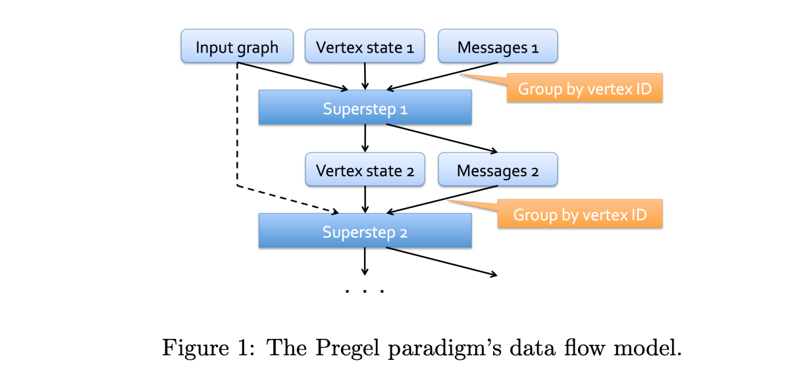
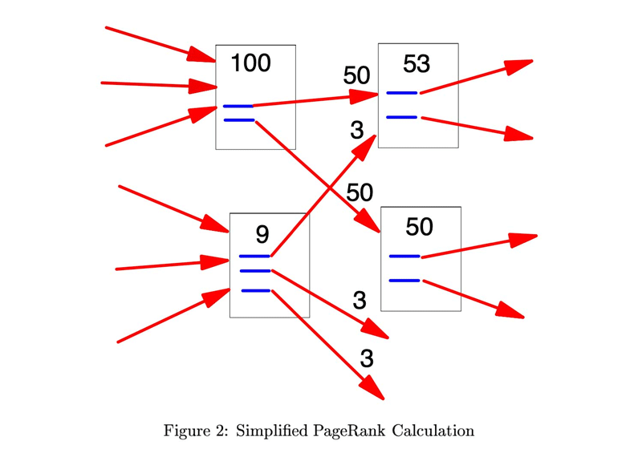

This tutorial covers GraphFrames' <a href="https://graphframes.io/api/python/graphframes.lib.html#graphframes.lib.Pregel">Pregel API</a> and <a href="https://graphframes.io/api/python/graphframes.lib.html#graphframes.lib.AggregateMessages">AggregateMessages API</a> for developing highly scalable graph algorithms. [Pregel](https://15799.courses.cs.cmu.edu/fall2013/static/papers/p135-malewicz.pdf) is a [bulk synchronous parallel](https://en.wikipedia.org/wiki/Bulk_synchronous_parallel) algorithm for distributed graph processing. Pregel and AggregateMessages are similar, and we'll cover the difference and when to use each algorithm.

* Table of contents (This text will be scraped.)
  {:toc}

<h2 id="pregel">What is Pregel?</h2>

Pregel is a [bulk synchronous parallel](https://en.wikipedia.org/wiki/Bulk_synchronous_parallel) algorithm for large scale graph processing described in the landmark 2010 paper [Pregel: A System for Large-Scale Graph Processing](https://15799.courses.cs.cmu.edu/fall2013/static/papers/p135-malewicz.pdf) from Grzegorz Malewicz, Matthew H. Austern, Aart J. C. Bik, James C. Dehnert, Ilan Horn, Naty Leiser, and Grzegorz Czajkowski at Google.

<blockquote>
    
Pregel is essentially a message-passing interface constrained to the edges of a graph. The idea
is to "think like a vertex" - algorithms within the Pregel framework are algorithms in which the
computation of state for a given node depends only on the states of its neighbours.

    <footer>
    — CME 323: Distributed Algorithms and Optimization, Spring 2015, Reza Zadeh, Databricks and Stanford
    </footer>
</blockquote>

    <figure>
        
        <figcaption><a href="http://stanford.edu/~rezab/dao/">CME 323: Distributed Algorithms and Optimization, Spring 2015, Reza Zadeh, Databricks and Stanford</a></figcaption>
    </figure>

<h2 id="stackexchange">Tutorial Dataset</h2>

As in the [Network Motif Tutorial](motif-tutorial.html#download-the-stack-exchange-dump-for-statsmeta), we will work with the [Stack Exchange Data Dump hosted at the Internet Archive](https://archive.org/details/stackexchange) using PySpark to build a property graph. To generate the knowledge graph for this tutorial, please refer to the [motif finding tutorial](motif-tutorial.html#download-the-stack-exchange-dump-for-statsmeta) before moving on to the next section.

<h2 id="inDegree">In-Degree in Pregel with AggreagateMessages</h2>

We begin with the simplest algorithm Pregel can run: computing the in-degree of every node in the graph. Let's start by loading our stats.meta knowledge graph and creating a SparkSession:


import pyspark.sql.functions as F
from graphframes import GraphFrame
from graphframes.lib import AggregateMessages as AM
from pyspark import SparkContext
from pyspark.sql import DataFrame, SparkSession

# Initialize a SparkSession
spark: SparkSession = (
    SparkSession.builder.appName("Stack Overflow Motif Analysis")
    # Lets the Id:(Stack Overflow int) and id:(GraphFrames ULID) coexist
    .config("spark.sql.caseSensitive", True)
    .getOrCreate()
)

# We created these in stackexchange.py from Stack Exchange data dump XML files
nodes_df: DataFrame = spark.read.parquet("python/graphframes/tutorials/data/stats.meta.stackexchange.com/Nodes.parquet")

# We created these in stackexchange.py from Stack Exchange data dump XML files
edges_df: DataFrame = spark.read.parquet("python/graphframes/tutorials/data/stats.meta.stackexchange.com/Edges.parquet")


Now let's walk through in-degree in Pregel:


# Initialize a column with 1 to transmit to other nodes
nodes_df = nodes_df.withColumn("start_degree", F.lit(1))

# Create a GraphFrame to get access to the Pregel aggregateMessages API
g: GraphFrame = GraphFrame(nodes_df, edges_df)

msgToDst = AM.src["start_degree"]
agg = g.aggregateMessages(
    F.sum(AM.msg).alias("in_degree"),
    sendToDst=msgToDst)
agg.show()


There's a problem, however - isolated or dangling nodes (those with no in-links) will not have degree zero, they simply won't appear in the data. You can see below the lowest in_degree is 1, not 0. There are definitely some 0 in-degree nodes in our knowledge graph.


agg.groupBy("in_degree").count().orderBy("in_degree").show(10)

+---------+-----+
|in_degree|count|
+---------+-----+
|        1|43165|
|        2|  341|
|        3|  218|
|        4|  289|
|        5|  326|
|        6|  371|
|        7|  318|
|        8|  338|
|        9|  304|
|       10|  299|
+---------+-----+


Here we LEFT JOIN all of the graph's vertices with the aggregated in-degrees and fill in undefined values with 0.


# join back and fill zeros
completeInDeg = (
    g.vertices
    .join(agg, on="id", how="left")   # isolates will have inDegree = null
    .na.fill(0, ["in_degree"])              # turn null → 0
    .select("id", "in_degree")
)


Now a histogram of degrees verifies the zeros have been added:


completeInDeg.groupBy("in_degree").count().orderBy("in_degree").show(10)

+---------+-----+                                                               
|in_degree|count|
+---------+-----+
|        0|81735|
|        1|43165|
|        2|  341|
|        3|  218|
|        4|  289|
|        5|  326|
|        6|  371|
|        7|  318|
|        8|  338|
|        9|  304|
+---------+-----+


We now join the Pregel degrees with the normal `g.inDegree` API to verify all values are identical:


# Join the Pregel degree with the normal GraphFrame.inDegree API
agg.join(g.inDegrees, on="id").show()


They are, as you can see below :)


+------------------------------------+---------+--------+
|id                                  |in_degree|inDegree|
+------------------------------------+---------+--------+
|10719232-7477-4189-9695-4f08b7a89853|27       |27      |
|470b6c69-41b3-4f08-b01c-9503b8face38|11       |11      |
|757efc82-5197-4d70-8df6-c887a636c1c8|17       |17      |
|0d07e249-d46d-421b-9de9-64fe388ba9ef|8        |8       |
|8ab3818a-f8a4-4cf7-91d6-e049e54342ce|6        |6       |
|51263d00-e0d0-429f-ad62-66cb9ee6b236|22       |22      |
|bb13c447-4c53-4679-abf8-62e894c3f063|3        |3       |
|8843ef7d-4fb6-4eb9-ad73-54c76083c955|10       |10      |
|1fb4aa84-bcdc-4ae2-b4c0-bfa715f87603|2        |2       |
|91f9eb5e-41f3-4d1b-9032-0554f0223bb9|7        |7       |
+------------------------------------+---------+--------+


<h2 id="pagerank">Implementing PageRank with aggregateMesssages</h2>

Let's move on to something more complex. PageRank was defined by Google cofounders Larry Page and Sergey Brin in a landmark 1999 paper <a href="https://www.cis.upenn.edu/~mkearns/teaching/NetworkedLife/pagerank.pdf">The PageRank Citation Rakning: Bringing Order to the Web</a>.

    <figure>
        
        <figcaption>A Simplified PageRank Calculation, from the <a href="https://www.cis.upenn.edu/~mkearns/teaching/NetworkedLife/pagerank.pdf">PageRank paper</a></figcaption>
    </figure>


# Initialize a column with 1 to transmit to other nodes
nodes_df = nodes_df.withColumn("start_pagerank", F.lit(1.0))

# Create a GraphFrame to get access to the Pregel aggregateMessages API
g: GraphFrame = GraphFrame(nodes_df, edges_df)

msgToDst = AM.src["start_degree"] / 
agg = g.aggregateMessages(
    F.sum(AM.msg).alias("in_degree"),
    sendToDst=msgToDst)
agg.show()


    <figure>
        
        <figcaption></figcaption>
    </figure>





<h2 id="combine-node-types">Combining Node Types</h2>

<h2 id="conclusion">Conclusion</h2>

In this tutorial, we learned to use GraphFrames' Pregel API.
