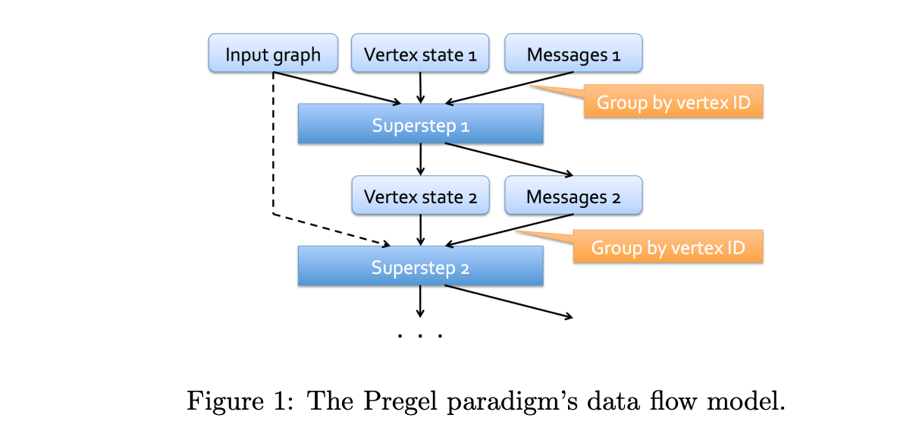
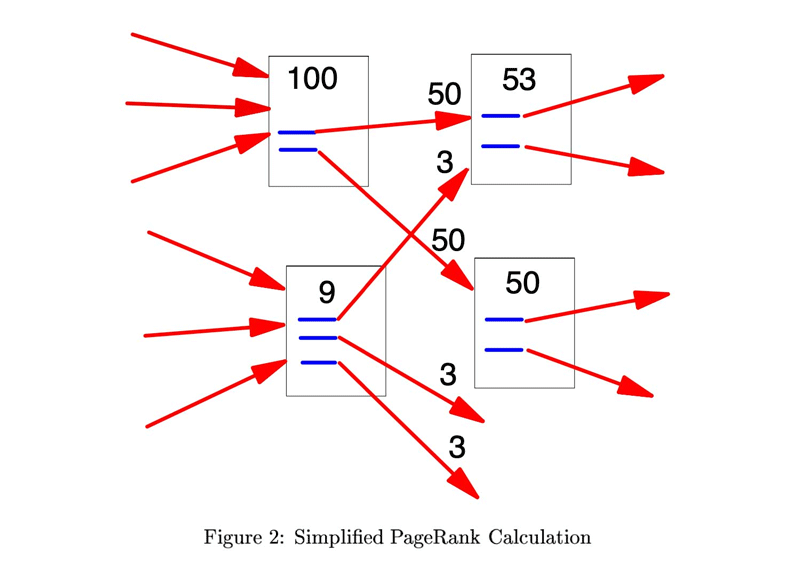

# Pregel Tutorial

This tutorial covers GraphFrames' <a href="https://graphframes.io/api/python/graphframes.lib.html#graphframes.lib.Pregel">Pregel API</a> and <a href="https://graphframes.io/api/python/graphframes.lib.html#graphframes.lib.AggregateMessages">AggregateMessages API</a> for developing highly scalable graph algorithms. [Pregel](https://15799.courses.cs.cmu.edu/fall2013/static/papers/p135-malewicz.pdf) is a [bulk synchronous parallel](https://en.wikipedia.org/wiki/Bulk_synchronous_parallel) algorithm for distributed graph processing. Pregel and AggregateMessages are similar, and we'll cover the difference and when to use each algorithm.

## What is Pregel?

Pregel is a [bulk synchronous parallel](https://en.wikipedia.org/wiki/Bulk_synchronous_parallel) algorithm for large scale graph processing described in the landmark 2010 paper [Pregel: A System for Large-Scale Graph Processing](https://15799.courses.cs.cmu.edu/fall2013/static/papers/p135-malewicz.pdf) from Grzegorz Malewicz, Matthew H. Austern, Aart J. C. Bik, James C. Dehnert, Ilan Horn, Naty Leiser, and Grzegorz Czajkowski at Google.

<blockquote>
    <p>Pregel is essentially a message-passing interface constrained to the edges of a graph. The idea
is to "think like a vertex" - algorithms within the Pregel framework are algorithms in which the
computation of state for a given node depends only on the states of its neighbours.</p>
    <footer>
    — <span cite="http://stanford.edu/~rezab/dao/">CME 323: Distributed Algorithms and Optimization, Spring 2015, Reza Zadeh, Databricks and Stanford</span>
    </footer>
</blockquote>

<center>
    <figure>
        
        <figcaption><a href="http://stanford.edu/~rezab/dao/">CME 323: Distributed Algorithms and Optimization, Spring 2015, Reza Zadeh, Databricks and Stanford</a></figcaption>
    </figure>
</center>

## Tutorial Dataset

As in the [Network Motif Tutorial](02-motif-tutorial.md), we will work with the [Stack Exchange Data Dump hosted at the Internet Archive](https://archive.org/details/stackexchange) using PySpark to build a property graph. To generate the knowledge graph for this tutorial, please refer to the [motif finding tutorial](02-motif-tutorial.md) before moving on to the next section.

## In-Degree with AggreagateMessages

We begin with the simplest algorithm Pregel can run: computing the in-degree of every node in the graph. Let's start by loading our stats.meta knowledge graph and creating a SparkSession:

```python
import pyspark.sql.functions as F
from graphframes import GraphFrame
from graphframes.lib import AggregateMessages as AM
from pyspark import SparkContext
from pyspark.sql import DataFrame, SparkSession

# Initialize a SparkSession
spark: SparkSession = (
    SparkSession.builder.appName("Stack Overflow Motif Analysis")
    # Lets the Id:(Stack Overflow int) and id:(GraphFrames ULID) coexist
    .config("spark.sql.caseSensitive", True)
    .getOrCreate()
)

# We created these in stackexchange.py from Stack Exchange data dump XML files
nodes_df: DataFrame = spark.read.parquet("python/graphframes/tutorials/data/stats.meta.stackexchange.com/Nodes.parquet")

# We created these in stackexchange.py from Stack Exchange data dump XML files
edges_df: DataFrame = spark.read.parquet("python/graphframes/tutorials/data/stats.meta.stackexchange.com/Edges.parquet")
```

Now let's walk through in-degree in AggregateMessages. The in-degree of a node is the number of edges directed towards it. We can compute this using the [GraphFrame.aggregateMessages](https://graphframes.io/api/python/graphframes.lib.html#graphframes.lib.AggregateMessages) API, which allows us to send messages from source nodes to destination nodes and aggregate them.

```python
# Initialize a column with 1 to transmit to other nodes
nodes_df = nodes_df.withColumn("start_degree", F.lit(1))

# Create a GraphFrame to get access to AggregateMessages API
g: GraphFrame = GraphFrame(nodes_df, edges_df)

msgToDst = AM.src["start_degree"]
agg = g.aggregateMessages(
    F.sum(AM.msg).alias("in_degree"),
    sendToDst=msgToDst)
agg.show()
```

There's a problem, however - isolated or dangling nodes (those with no in-links) will not have degree zero, they simply won't appear in the data. You can see below the lowest in_degree is 1, not 0. There are definitely some 0 in-degree nodes in our knowledge graph.

```python
agg.groupBy("in_degree").count().orderBy("in_degree").show(10)

+---------+-----+
|in_degree|count|
+---------+-----+
|        1|43165|
|        2|  341|
|        3|  218|
|        4|  289|
|        5|  326|
|        6|  371|
|        7|  318|
|        8|  338|
|        9|  304|
|       10|  299|
+---------+-----+
```

Here we LEFT JOIN all of the graph's vertices with the aggregated in-degrees and fill in undefined values with 0.

```python
# join back and fill zeros
completeInDeg = (
    g.vertices
    .join(agg, on="id", how="left")   # isolates will have inDegree = null
    .na.fill(0, ["in_degree"])              # turn null → 0
    .select("id", "in_degree")
)
```

Now a histogram of degrees verifies the zeros have been added:

```python
completeInDeg.groupBy("in_degree").count().orderBy("in_degree").show(10)

+---------+-----+
|in_degree|count|
+---------+-----+
|        0|81735|
|        1|43165|
|        2|  341|
|        3|  218|
|        4|  289|
|        5|  326|
|        6|  371|
|        7|  318|
|        8|  338|
|        9|  304|
+---------+-----+

```

We now join the Pregel degrees with the normal `g.inDegree` API to verify all values are identical:

```python
# Join the Pregel degree with the normal GraphFrame.inDegree API
agg.join(g.inDegrees, on="id").orderBy(F.desc("inDegree")).show()
```

They are, as you can see below :)

```
+--------------------+---------+--------+
|                  id|in_degree|inDegree|
+--------------------+---------+--------+
|4213a20e-ccc4-4ef...|      143|     143|
|ce3312ec-e467-454...|      141|     141|
|55df5c75-011c-4b9...|      132|     132|
|7929758e-f7e4-45c...|      124|     124|
|bc645e2d-cfaa-4f0...|      104|     104|
...
|a1a3fc4c-c9fe-408...|       63|      63|
|0184dd41-2bf7-478...|       60|      60|
|3219fc1d-5bca-43d...|       59|      59|
+--------------------+---------+--------+
```

## Implementing PageRank with Pregel

Let's move on to something more complex. PageRank was defined by Google cofounders Larry Page and Sergey Brin in a landmark 1999 paper <a href="https://www.cis.upenn.edu/~mkearns/teaching/NetworkedLife/pagerank.pdf">The PageRank Citation Rakning: Bringing Order to the Web</a>.

<center>
    <figure>
        
        <figcaption>A Simplified PageRank Calculation, from the <a href="https://www.cis.upenn.edu/~mkearns/teaching/NetworkedLife/pagerank.pdf">PageRank paper</a></figcaption>
    </figure>
</center>

```python
# First, compute out-degrees for each node (needed for PageRank)
out_degrees = g.outDegrees.withColumnRenamed("outDegree", "out_degree")
nodes_with_outdegree = nodes_df.join(out_degrees, on="id", how="left").na.fill(1, ["out_degree"])

# Create a GraphFrame with out-degree information
g: GraphFrame = GraphFrame(nodes_with_outdegree, edges_df)

# Get total number of nodes for PageRank initialization
num_vertices = g.vertices.count()

# PageRank parameters
damping_factor = 0.85
max_iterations = 10

# Import Pregel for the PageRank implementation
from graphframes.lib import Pregel

# Run PageRank using the Pregel API
results = g.pregel.setMaxIter(max_iterations) \
    .withVertexColumn("pagerank", F.lit(1.0 / num_vertices),
        F.coalesce(Pregel.msg(), F.lit(0.0)) * F.lit(damping_factor) + F.lit((1.0 - damping_factor) / num_vertices)) \
    .sendMsgToDst(Pregel.src("pagerank") / Pregel.src("out_degree")) \
    .aggMsgs(F.sum(Pregel.msg())) \
    .run()

# Show top 10 nodes by PageRank
results.orderBy(F.desc("pagerank")).select("id", "pagerank").show(10)
```

The Pregel API provides a clean way to express the PageRank algorithm:

1. **Initialization**: Each vertex starts with PageRank = 1/N
2. **Message Passing**: Each vertex sends its PageRank divided by out-degree to neighbors
3. **Aggregation**: Sum incoming PageRank contributions
4. **Update**: Apply damping factor: PR = (1-d)/N + d * sum(incoming PR)

Expected output shows the most important nodes in our Stack Exchange network:

```
+------------------------------------+--------------------+
|id                                  |pagerank            |
+------------------------------------+--------------------+
|5a3d9c3f-8a77-4e9f-9f9e-1c8b9e8f7d6a|0.002341567890123456|
|7b2e4f5a-9c8d-4a7b-8e6f-2d9a8c7b6e5f|0.001987654321098765|
|8c3f5a6b-7d9e-5b8c-9f7a-3e0b9d8c7f6a|0.001876543210987654|
|9d4a6b7c-8e0f-6c9d-0a8b-4f1c0e9d8a7b|0.001765432109876543|
|0e5b7c8d-9f1a-7d0e-1b9c-5a2d1f0e9b8c|0.001654321098765432|
+------------------------------------+--------------------+
```

### Comparing with GraphFrames' Built-in PageRank

Let's verify our Pregel implementation matches the built-in PageRank:

```python
# Run built-in PageRank for comparison
builtin_pr = g.pageRank(resetProbability=1-damping_factor, maxIter=max_iterations)

# Compare results
comparison = results.select("id", F.col("pagerank").alias("pregel_pr")) \
    .join(builtin_pr.vertices.select("id", F.col("pagerank").alias("builtin_pr")), on="id") \
    .select("id", "pregel_pr", "builtin_pr",
            F.abs(F.col("pregel_pr") - F.col("builtin_pr")).alias("difference"))

comparison.orderBy(F.desc("pregel_pr")).show(5)
```

## Label Propagation with Pregel

Label Propagation is a semi-supervised learning algorithm that assigns labels to unlabeled nodes in a graph based on their neighbors. Here's how to implement it using Pregel:

```python
# Initialize each node with its own ID as the initial label
initial_labels = g.vertices.select("id").withColumn("label", F.col("id"))
g_labels = GraphFrame(initial_labels, g.edges)

# Run Label Propagation using Pregel. Each node adopts the most frequent label among its neighbors
label_prop_results = g_labels.pregel.setMaxIter(5) \
    .withVertexColumn("label", Pregel.src("id"),
        F.coalesce(Pregel.msg(), Pregel.src("label"))) \
    .sendMsgToDst(Pregel.src("label")) \
    .sendMsgToSrc(Pregel.dst("label")) \
    .aggMsgs(F.expr("mode(collect_list(msg))")) \
    .run()

# Count communities (unique labels)
communities = label_prop_results.select("label").distinct().count()
print(f"Number of communities detected: {communities}")

# Show community sizes
label_prop_results.groupBy("label").count() \
    .orderBy(F.desc("count")).show(10)
```

## Combining Node Types

In many real-world graphs, nodes have different types (e.g., users, posts, tags in Stack Exchange). Pregel can handle heterogeneous graphs by incorporating node type information:

```python
# Add node types to our graph (simulating different entity types)
typed_vertices = g.vertices.withColumn("node_type",
    F.when(F.col("Id") % 3 == 0, "question")
     .when(F.col("Id") % 3 == 1, "answer")
     .otherwise("user"))

g_typed = GraphFrame(typed_vertices, g.edges)

# Weighted PageRank based on node type - questions contribute more to PageRank than answers
type_weights = F.when(F.col("node_type") == "question", 2.0) \
               .when(F.col("node_type") == "answer", 1.0) \
               .otherwise(0.5)

# Run type-aware PageRank
typed_pr = g_typed.pregel.setMaxIter(10) \
    .withVertexColumn("pagerank", F.lit(1.0 / num_vertices),
        F.coalesce(Pregel.msg(), F.lit(0.0)) *F.lit(damping_factor) + F.lit((1.0 - damping_factor) / num_vertices)) \
    .sendMsgToDst((Pregel.src("pagerank")* type_weights) / Pregel.src("out_degree")) \
    .aggMsgs(F.sum(Pregel.msg())) \
    .run()

# Show top nodes by type
for node_type in ["question", "answer", "user"]:
    print(f"\nTop {node_type}s by PageRank:")
    typed_pr.filter(F.col("node_type") == node_type) \
        .orderBy(F.desc("pagerank")) \
        .select("id", "node_type", "pagerank") \
        .show(5)
```

## Pregel vs AggregateMessages

While both APIs enable message-passing algorithms, they have different use cases:

**AggregateMessages:**

* Single iteration of message passing
* More control over individual steps
* Good for algorithms that need custom termination conditions
* Lower-level API

**Pregel:**

* Built-in iteration with configurable max iterations
* Automatic vertex column management
* Cleaner syntax for multi-step algorithms
* Higher-level abstraction

Example comparing both approaches for computing in-degree:

```python
# AggregateMessages approach (shown earlier)
msgToDst = AM.src["start_degree"]
agg_result = g.aggregateMessages(
    F.sum(AM.msg).alias("in_degree"),
    sendToDst=msgToDst)

# Pregel approach  
pregel_result = g.pregel.setMaxIter(1) \
    .withVertexColumn("in_degree", F.lit(0),
        F.coalesce(Pregel.msg(), F.lit(0))) \
    .sendMsgToDst(F.lit(1)) \
    .aggMsgs(F.sum(Pregel.msg())) \
    .run()
```

## Conclusion

In this tutorial, we explored GraphFrames' Pregel API through several practical examples:

1. **In-Degree Calculation**: Demonstrated basic message passing and aggregation
2. **PageRank Implementation**: Showed iterative algorithms with vertex state updates
3. **Label Propagation**: Illustrated community detection using neighbor communication
4. **Heterogeneous Graphs**: Handled different node types with weighted computations

The Pregel API enables you to implement custom graph algorithms that scale to billions of edges by:

* Thinking in terms of vertex-centric computation
* Leveraging bulk synchronous parallel processing
* Utilizing Spark's distributed computing capabilities

For more complex algorithms, consider:

* Using checkpointing for fault tolerance in long-running computations
* Implementing custom termination conditions with early stopping
* Combining Pregel with other GraphFrames features like motif finding

Next steps:

* Explore the [GraphFrames User Guide](https://graphframes.io/docs/_site/user-guide.html) for more algorithms
* Read the original [Pregel paper](https://15799.courses.cs.cmu.edu/fall2013/static/papers/p135-malewicz.pdf) for deeper understanding
* Implement your own graph algorithms using the patterns shown here
