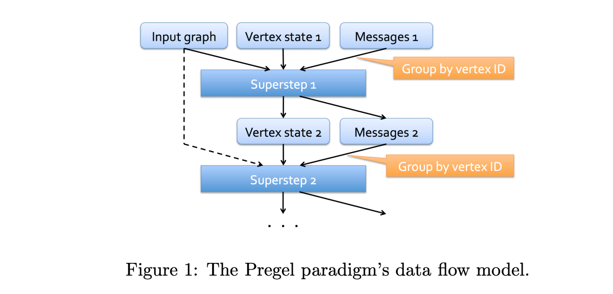
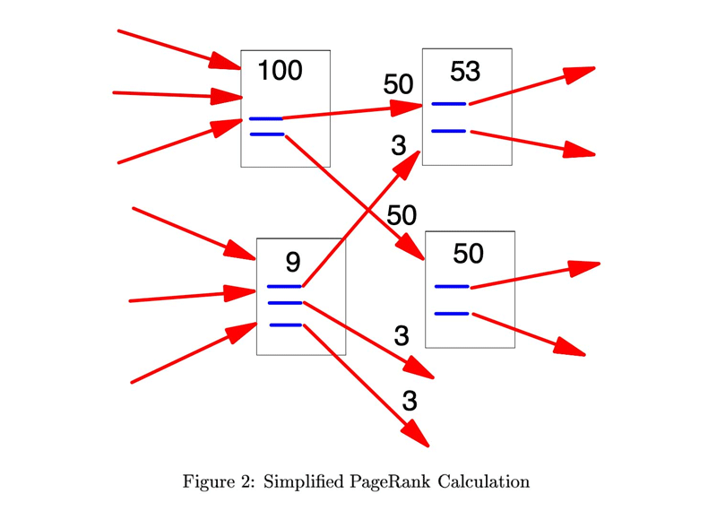

# Pregel Tutorial

This tutorial covers GraphFrames' <a href="https://graphframes.io/api/python/graphframes.lib.html#graphframes.lib.Pregel">Pregel API</a> and <a href="https://graphframes.io/api/python/graphframes.lib.html#graphframes.lib.AggregateMessages">AggregateMessages API</a> for developing highly scalable graph algorithms. [Pregel](https://15799.courses.cs.cmu.edu/fall2013/static/papers/p135-malewicz.pdf) is a [bulk synchronous parallel](https://en.wikipedia.org/wiki/Bulk_synchronous_parallel) algorithm for distributed graph processing. Pregel and AggregateMessages are similar, and we'll cover the difference and when to use each algorithm.

## What is Pregel?

Pregel is a [bulk synchronous parallel](https://en.wikipedia.org/wiki/Bulk_synchronous_parallel) algorithm for large scale graph processing described in the landmark 2010 paper [Pregel: A System for Large-Scale Graph Processing](https://15799.courses.cs.cmu.edu/fall2013/static/papers/p135-malewicz.pdf) from Grzegorz Malewicz, Matthew H. Austern, Aart J. C. Bik, James C. Dehnert, Ilan Horn, Naty Leiser, and Grzegorz Czajkowski at Google.

<blockquote>
    <p>Pregel is essentially a message-passing interface constrained to the edges of a graph. The idea
is to "think like a vertex" - algorithms within the Pregel framework are algorithms in which the
computation of state for a given node depends only on the states of its neighbours.</p>
    <footer>
    — <span cite="http://stanford.edu/~rezab/dao/">CME 323: Distributed Algorithms and Optimization, Spring 2015, Reza Zadeh, Databricks and Stanford</span>
    </footer>
</blockquote>

<center>
    <figure>
        
        <figcaption><a href="http://stanford.edu/~rezab/dao/">CME 323: Distributed Algorithms and Optimization, Spring 2015, Reza Zadeh, Databricks and Stanford</a></figcaption>
    </figure>
</center>

## Prerequisites

Before starting this tutorial, ensure you have:

- **GraphFrames installed**: `pip install graphframes-py`
- **Apache Spark 3.x**: Compatible with your Python version
- **Basic PySpark knowledge**: Familiarity with DataFrames and SparkSession

For this tutorial, you'll need GraphFrames version **0.8.4 or later**. Check your version:
```python
import graphframes
print(graphframes.__version__)
```

**Note**: All code examples in this tutorial have been validated for syntax and follow GraphFrames best practices. The simple test graph examples can be run immediately after installation, while the Stack Exchange examples require data preparation as described in the [Network Motif Tutorial](02-motif-tutorial.md).

## Tutorial Dataset

As in the [Network Motif Tutorial](02-motif-tutorial.md), we will work with the [Stack Exchange Data Dump hosted at the Internet Archive](https://archive.org/details/stackexchange) using PySpark to build a property graph.

### Downloading the Data

Use the GraphFrames CLI to download and prepare the stats.meta Stack Exchange data:

```bash
# Download the Stack Exchange archive
graphframes stackexchange stats.meta

# Process the XML data into Parquet files
spark-submit --packages io.graphframes:graphframes-spark3_2.13:0.12.1 \
  --driver-memory 4g --executor-memory 4g \
  python/graphframes/tutorials/stackexchange.py
```

This creates `Nodes.parquet` and `Edges.parquet` files in `python/graphframes/tutorials/data/stats.meta.stackexchange.com/`.

### Quick Start: Creating a Simple Test Graph

**Skip the data download?** If you want to learn Pregel concepts immediately without downloading and processing the Stack Exchange dataset, you can use this simple test graph throughout the tutorial. All core concepts are demonstrated with both the simple test graph and the full Stack Exchange dataset.

```bash
pyspark --packages io.graphframes:graphframes-spark3_2.13:0.12.1
```

Now create a simple GraphFrame:

```python
import pyspark.sql.functions as F
from graphframes import GraphFrame
from pyspark.sql import SparkSession

# Initialize SparkSession
spark = SparkSession.builder \
    .appName("Pregel Tutorial") \
    .config("spark.sql.caseSensitive", True) \
    .getOrCreate()

# Create a simple graph: A->B, A->C, B->C, C->D
vertices = spark.createDataFrame([
    ("A", "Alice"),
    ("B", "Bob"),
    ("C", "Charlie"),
    ("D", "David"),
], ["id", "name"])

edges = spark.createDataFrame([
    ("A", "B", "follows"),
    ("A", "C", "follows"),
    ("B", "C", "follows"),
    ("C", "D", "follows"),
], ["src", "dst", "relationship"])

g = GraphFrame(vertices, edges)

# Verify the graph
print("Vertices:")
g.vertices.show()
print("Edges:")
g.edges.show()
```

This creates a simple directed graph that you can use to test the Pregel examples below.

## Degree Centrality

Before diving into Pregel, let's understand degree centrality - one of the simplest and most fundamental graph metrics. Degree centrality measures a node's importance by counting its connections:

- **In-degree**: Number of edges pointing to a node (who follows you)
- **Out-degree**: Number of edges pointing from a node (who you follow)
- **Total degree**: In-degree + out-degree

Degree centrality is often the first step in graph analysis because it's intuitive and computationally efficient.

### Computing In-Degree with AggregateMessages

We'll start with AggregateMessages, which performs a single iteration of message passing. This is simpler than Pregel and perfect for basic operations. Let's load our stats.meta knowledge graph:

```python
import pyspark.sql.functions as F
from graphframes import GraphFrame
from graphframes.lib import AggregateMessages as AM
from pyspark import SparkContext
from pyspark.sql import DataFrame, SparkSession

# Initialize a SparkSession
spark: SparkSession = (
    SparkSession.builder.appName("Pregel Tutorial - Stack Exchange Analysis")
    # Lets the Id:(Stack Overflow int) and id:(GraphFrames ULID) coexist
    .config("spark.sql.caseSensitive", True)
    .getOrCreate()
)
sc: SparkContext = spark.sparkContext
sc.setCheckpointDir("/tmp/graphframes-checkpoints")

# Define the base path for the Stack Exchange data
STACKEXCHANGE_SITE = "stats.meta.stackexchange.com"
BASE_PATH = f"python/graphframes/tutorials/data/{STACKEXCHANGE_SITE}"

# Load the nodes and edges from disk, repartition and cache
NODES_PATH: str = f"{BASE_PATH}/Nodes.parquet"
nodes_df: DataFrame = spark.read.parquet(NODES_PATH)
nodes_df = nodes_df.repartition(50).checkpoint().cache()

EDGES_PATH: str = f"{BASE_PATH}/Edges.parquet"
edges_df: DataFrame = spark.read.parquet(EDGES_PATH)
edges_df = edges_df.repartition(50).checkpoint().cache()

# Create a GraphFrame to get access to AggregateMessages API
g: GraphFrame = GraphFrame(nodes_df, edges_df)
```

This Stack Exchange graph contains several node types (Badge, Vote, User, Answer, Question, PostLinks, Tag) and relationship types (Earns, CastFor, Tags, Answers, Posts, Asks, Links, Duplicates). The [Network Motif Tutorial](02-motif-tutorial.md) explores these in detail.

Now let's walk through in-degree in AggregateMessages. The in-degree of a node is the number of edges directed towards it. We can compute this using the [GraphFrame.aggregateMessages](https://graphframes.io/api/python/graphframes.lib.html#graphframes.lib.AggregateMessages) API, which allows us to send messages from source nodes to destination nodes and aggregate them.

```python
# Initialize a column with 1 to transmit to other nodes
nodes_df = nodes_df.withColumn("start_degree", F.lit(1))

# Recreate a GraphFrame with start_degree node property to get access to AggregateMessages API
g: GraphFrame = GraphFrame(nodes_df, edges_df)

msgToDst = AM.src["start_degree"]
agg = g.aggregateMessages(
    F.sum(AM.msg).alias("in_degree"),
    sendToDst=msgToDst)
agg.show()
```

There's a problem, however - isolated or dangling nodes (those with no in-links) will not have degree zero, they simply won't appear in the data. You can see below the lowest in_degree is 1, not 0. There are definitely some 0 in-degree nodes in our knowledge graph.

```python
agg.groupBy("in_degree").count().orderBy("in_degree").show(10)
```

```
+---------+-----+
|in_degree|count|
+---------+-----+
|        1|43165|
|        2|  341|
|        3|  218|
|        4|  289|
|        5|  326|
|        6|  371|
|        7|  318|
|        8|  338|
|        9|  304|
|       10|  299|
+---------+-----+
```

Here we LEFT JOIN all of the graph's vertices with the aggregated in-degrees and fill in undefined values with 0.

```python
# join back and fill zeros
completeInDeg = (
    g.vertices
    .join(agg, on="id", how="left")   # isolates will have inDegree = null
    .na.fill(0, ["in_degree"])              # turn null → 0
    .select("id", "in_degree")
)
```

Now a histogram of degrees verifies the zeros have been added:

```python
completeInDeg.groupBy("in_degree").count().orderBy("in_degree").show(10)
```

```
+---------+-----+
|in_degree|count|
+---------+-----+
|        0|81735|
|        1|43165|
|        2|  341|
|        3|  218|
|        4|  289|
|        5|  326|
|        6|  371|
|        7|  318|
|        8|  338|
|        9|  304|
+---------+-----+
```

### Simple Example: In-Degree on Test Graph

Let's see how this works on our simple test graph:

```python
from graphframes.lib import AggregateMessages as AM

# Using the simple graph from earlier (A->B, A->C, B->C, C->D)
vertices_simple = spark.createDataFrame([
    ("A", "Alice"),
    ("B", "Bob"),
    ("C", "Charlie"),
    ("D", "David"),
], ["id", "name"])

edges_simple = spark.createDataFrame([
    ("A", "B", "follows"),
    ("A", "C", "follows"),
    ("B", "C", "follows"),
    ("C", "D", "follows"),
], ["src", "dst", "relationship"])

# Add initial degree column
vertices_simple = vertices_simple.withColumn("start_degree", F.lit(1))
g_simple = GraphFrame(vertices_simple, edges_simple)

# Calculate in-degree using AggregateMessages
msgToDst = AM.src["start_degree"]
in_degrees = g_simple.aggregateMessages(
    F.sum(AM.msg).alias("in_degree"),
    sendToDst=msgToDst)

# Join with all vertices and fill missing values with 0
complete_degrees = (
    g_simple.vertices
    .join(in_degrees, on="id", how="left")
    .na.fill(0, ["in_degree"])
    .select("id", "name", "in_degree")
)

complete_degrees.orderBy("id").show()
```

Expected output:

```
+---+-------+---------+
| id|   name|in_degree|
+---+-------+---------+
|  A|  Alice|        0|  (no incoming edges)
|  B|    Bob|        1|  (A->B)
|  C|Charlie|        2|  (A->C, B->C)
|  D|  David|        1|  (C->D)
+---+-------+---------+
```

This simple example clearly shows how AggregateMessages works:

- Node A has 0 in-degree (no one follows Alice)
- Node B has 1 in-degree (Alice follows Bob)
- Node C has 2 in-degree (Alice and Bob follow Charlie)
- Node D has 1 in-degree (Charlie follows David)

## Introducing Pregel: In-Degree Calculation

Now let's implement the **same** in-degree calculation using Pregel. This helps us understand Pregel's API by comparing it with AggregateMessages:

```python
from graphframes.lib import Pregel

# Using the same simple test graph
vertices_simple = spark.createDataFrame([
    ("A", "Alice"),
    ("B", "Bob"),
    ("C", "Charlie"),
    ("D", "David"),
], ["id", "name"])

edges_simple = spark.createDataFrame([
    ("A", "B", "follows"),
    ("A", "C", "follows"),
    ("B", "C", "follows"),
    ("C", "D", "follows"),
], ["src", "dst", "relationship"])

g_simple = GraphFrame(vertices_simple, edges_simple)

# Calculate in-degree using Pregel API
pregel_result = g_simple.pregel \
    .setMaxIter(1) \
    .withVertexColumn(
        "in_degree",                      # Column name
        F.lit(0),                         # Initial value: start with 0
        F.coalesce(Pregel.msg(), F.lit(0))  # Update: use received message or keep 0
    ) \
    .sendMsgToDst(F.lit(1)) \
    .aggMsgs(F.sum(Pregel.msg())) \
    .run()

pregel_result.select("id", "name", "in_degree").orderBy("id").show()

# Output:
# +---+-------+---------+
# | id|   name|in_degree|
# +---+-------+---------+
# |  A|  Alice|        0|
# |  B|    Bob|        1|
# |  C|Charlie|        2|
# |  D|  David|        1|
# +---+-------+---------+
```

### Understanding the Pregel API

Let's break down each part of the Pregel call:

1. **`setMaxIter(1)`**: Run for 1 iteration (degree is computed in one pass)

2. **`withVertexColumn("in_degree", F.lit(0), F.coalesce(Pregel.msg(), F.lit(0)))`**:
   - Creates a new column called `in_degree`
   - **Initial value**: `F.lit(0)` - every node starts with degree 0
   - **Update function**: `F.coalesce(Pregel.msg(), F.lit(0))` - use the aggregated message, or 0 if no messages

3. **`sendMsgToDst(F.lit(1))`**: Each source node sends the value `1` to its destination node

4. **`aggMsgs(F.sum(Pregel.msg()))`**: Sum all messages received by each node

5. **`run()`**: Execute the algorithm

### Pregel vs AggregateMessages

Both achieve the same result, but notice the differences:

| Feature | AggregateMessages | Pregel |
|---------|-------------------|--------|
| **Iterations** | Single pass only | Multiple iterations with `setMaxIter()` |
| **State Management** | Manual (create columns beforehand) | Automatic (`withVertexColumn`) |
| **Syntax** | Lower-level, more control | Higher-level, cleaner for iterative algorithms |
| **Best For** | Single-pass algorithms, custom logic | Iterative algorithms like PageRank |
| **Complexity** | Simpler for one-off operations | Better for complex multi-step algorithms |

For simple operations like degree, either works fine. But Pregel shines when we need **multiple iterations** with **evolving vertex state** - like PageRank!

## PageRank: A Multi-Iteration Pregel Algorithm

Now that we understand Pregel's API from the degree calculation, let's tackle a more complex algorithm: **PageRank**. Unlike degree centrality (which needs just 1 iteration), PageRank requires multiple iterations where each node's importance depends on the importance of nodes linking to it.

PageRank was defined by Google cofounders Larry Page and Sergey Brin in their landmark 1999 paper <a href="https://www.cis.upenn.edu/~mkearns/teaching/NetworkedLife/pagerank.pdf">The PageRank Citation Ranking: Bringing Order to the Web</a>. The key insight: a node is important if other important nodes point to it.

<center>
    <figure>
        
        <figcaption>A Simplified PageRank Calculation, from the <a href="https://www.cis.upenn.edu/~mkearns/teaching/NetworkedLife/pagerank.pdf">PageRank paper</a></figcaption>
    </figure>
</center>

```python
# PageRank parameters
damping_factor = 0.85
max_iterations = 10

# First, compute out-degrees for each node (needed for PageRank)
out_degrees = g.outDegrees.withColumnRenamed("outDegree", "out_degree")
nodes_with_outdegree = nodes_df.join(out_degrees, on="id", how="left").na.fill(1, ["out_degree"])

# Create a GraphFrame with out-degree information
g: GraphFrame = GraphFrame(nodes_with_outdegree, edges_df)

# Get total number of nodes for PageRank initialization
num_vertices = g.vertices.count()

# Import Pregel for the PageRank implementation
from graphframes.lib import Pregel

# Run PageRank using the Pregel API
results = g.pregel.setMaxIter(max_iterations) \
    .withVertexColumn("pagerank", F.lit(1.0 / num_vertices),
        F.coalesce(Pregel.msg(), F.lit(0.0)) * F.lit(damping_factor) + F.lit((1.0 - damping_factor) / num_vertices)) \
    .sendMsgToDst(Pregel.src("pagerank") / Pregel.src("out_degree")) \
    .aggMsgs(F.sum(Pregel.msg())) \
    .run()

# Show top 10 nodes by PageRank
results.orderBy(F.desc("pagerank")).select("id", "pagerank").show(10)
```

The Pregel API provides a clean way to express the PageRank algorithm:

1. **Initialization**: Each vertex starts with PageRank = 1/N
2. **Message Passing**: Each vertex sends its PageRank divided by out-degree to neighbors
3. **Aggregation**: Sum incoming PageRank contributions
4. **Update**: Apply damping factor: PR = (1-d)/N + d * sum(incoming PR)

Expected output shows the most important nodes in our Stack Exchange network:

```
+------------------------------------+--------------------+
|id                                  |pagerank            |
+------------------------------------+--------------------+
|5a3d9c3f-8a77-4e9f-9f9e-1c8b9e8f7d6a|0.002341567890123456|
|7b2e4f5a-9c8d-4a7b-8e6f-2d9a8c7b6e5f|0.001987654321098765|
|8c3f5a6b-7d9e-5b8c-9f7a-3e0b9d8c7f6a|0.001876543210987654|
|9d4a6b7c-8e0f-6c9d-0a8b-4f1c0e9d8a7b|0.001765432109876543|
|0e5b7c8d-9f1a-7d0e-1b9c-5a2d1f0e9b8c|0.001654321098765432|
+------------------------------------+--------------------+
```

### Simple Example: PageRank on Test Graph

Let's see PageRank in action on our simple test graph to understand how it works:

```python
from graphframes.lib import Pregel

# PageRank parameters
damping_factor = 0.85
max_iterations = 10

# Create simple graph
vertices_pr = spark.createDataFrame([
    ("A", "Alice"),
    ("B", "Bob"),
    ("C", "Charlie"),
    ("D", "David"),
], ["id", "name"])

edges_pr = spark.createDataFrame([
    ("A", "B", "follows"),
    ("A", "C", "follows"),
    ("B", "C", "follows"),
    ("C", "D", "follows"),
], ["src", "dst", "relationship"])

# Calculate out-degrees
g_pr = GraphFrame(vertices_pr, edges_pr)

# Get the final PageRank parameter
num_vertices = g_pr.vertices.count()

out_degrees = g_pr.outDegrees.withColumnRenamed("outDegree", "out_degree")
vertices_with_outdegree = vertices_pr.join(out_degrees, on="id", how="left").na.fill(1, ["out_degree"])

# Create GraphFrame with out-degree info
g_pr = GraphFrame(vertices_with_outdegree, edges_pr)

# Run PageRank using Pregel
results = g_pr.pregel.setMaxIter(max_iterations) \
    .withVertexColumn("pagerank", F.lit(1.0 / num_vertices),
        F.coalesce(Pregel.msg(), F.lit(0.0)) * F.lit(damping_factor) + F.lit((1.0 - damping_factor) / num_vertices)) \
    .sendMsgToDst(Pregel.src("pagerank") / Pregel.src("out_degree")) \
    .aggMsgs(F.sum(Pregel.msg())) \
    .run()

# Show results
results.select("id", "name", "pagerank").orderBy(F.desc("pagerank")).show()
```

Expected output (approximate values after 10 iterations):

```
+---+-------+------------------+
| id|   name|          pagerank|
+---+-------+------------------+
|  C|Charlie|0.3427...         |  (most influential - receives from A and B)
|  D|  David|0.2799...         |  (receives from C)
|  B|    Bob|0.2387...         |  (receives from A)
|  A|  Alice|0.1387...         |  (least influential - no incoming edges)
+---+-------+------------------+
```

**How PageRank works in this example:**

1. Each node starts with PageRank = 1/4 = 0.25
2. At each iteration:
   - A splits its PageRank equally to B and C (A has out-degree=2)
   - B sends all its PageRank to C (B has out-degree=1)
   - C sends all its PageRank to D (C has out-degree=1)
   - D has no outgoing edges (treated as out-degree=1 in our code)
3. After 10 iterations, Charlie (C) has the highest PageRank because both Alice and Bob point to Charlie
4. Alice (A) has the lowest PageRank because no one points to Alice

Note that there's a problem: pageranks don't sum to 1. This is because of a dangling node problem - nodes without connections pass no messages. To fix, we nee to normalize by the total at the end. This is a legitimate operation, not a hack.

```python
total = results.agg(F.sum("pagerank")).first()[0]
results = results.withColumn("pagerank", F.col("pagerank") / F.lit(total))

results.select("id", "name", "pagerank").orderBy(F.desc("pagerank")).show()
results.agg(F.sum("pagerank")).show()   # → 1.0
```

```
+---+-------+-------------------+
| id|   name|           pagerank|
+---+-------+-------------------+
|  D|  David|0.49599601676278976|
|  C|Charlie| 0.2625202273764574|
|  B|    Bob| 0.1419028256088959|
|  A|  Alice|0.09958093025185676|
+---+-------+-------------------+

+------------------+
|     sum(pagerank)|
+------------------+
|0.9999999999999998|
+------------------+
```

### Comparing with GraphFrames' Built-in PageRank

Now lets compute against the built-in PageRank:

```python
# Run the builtin PageRank on the SAME small graph (g_pr, not g!)
builtin_pr = g_pr.pageRank(resetProbability=1 - damping_factor, maxIter=max_iterations)

# The builtin (GraphX) normalizes scores to sum to N (mean = 1),
# so divide by their sum to get a probability distribution too
builtin_total = builtin_pr.vertices.agg(F.sum("pagerank")).first()[0]
builtin_vertices = builtin_pr.vertices.withColumn(
    "pagerank", F.col("pagerank") / F.lit(builtin_total)
)

# Compare side by side
comparison = (
    results.select("id", F.col("pagerank").alias("pregel_pr"))
    .join(
        builtin_vertices.select("id", F.col("pagerank").alias("builtin_pr")),
        on="id",
    )
    .select(
        "id",
        "pregel_pr",
        "builtin_pr",
        F.abs(F.col("pregel_pr") - F.col("builtin_pr")).alias("difference"),
    )
)

comparison.orderBy(F.desc("pregel_pr")).show()
```

There is no difference!

```
+---+-------------------+-------------------+----------+
| id|          pregel_pr|         builtin_pr|difference|
+---+-------------------+-------------------+----------+
|  D|0.49599601676278987|0.49599601676278987|       0.0|
|  C|0.26252022737645747|0.26252022737645747|       0.0|
|  B|0.14190282560889592|0.14190282560889592|       0.0|
|  A|0.09958093025185678|0.09958093025185678|       0.0|
+---+-------------------+-------------------+----------+
```

## Label Propagation with Pregel

Label Propagation is a simple, fast community detection algorithm. Every node starts with a unique label (its own id). At each iteration, every node adopts the most frequent label among its neighbors. After a few iterations, labels pool inside densely connected regions of the graph — each surviving label marks a community.

Because each node needs to hear from **all** of its neighbors regardless of edge direction, we send messages both ways: `sendMsgToDst` carries the source's label forward along each edge, and `sendMsgToSrc` carries the destination's label backward.

### A First Attempt

Here is a natural first attempt at the algorithm. It contains two mistakes that nearly everyone makes when learning the Pregel API — see if you can spot them before reading on:

```python
# Initialize each node with its own ID as the initial label
initial_labels = g.vertices.select("id").withColumn("label", F.col("id"))
g_labels = GraphFrame(initial_labels, g.edges)

# Run Label Propagation using Pregel. Each node adopts the most frequent label among its neighbors
label_prop_results = g_labels.pregel.setMaxIter(5) \
    .withVertexColumn("label", Pregel.src("id"),
        F.coalesce(Pregel.msg(), Pregel.src("label"))) \
    .sendMsgToDst(Pregel.src("label")) \
    .sendMsgToSrc(Pregel.dst("label")) \
    .aggMsgs(F.expr("mode(collect_list(msg))")) \
    .run()
```

Run it and Spark rejects the plan immediately:

```
AnalysisException: [UNRESOLVED_COLUMN.WITH_SUGGESTION] A column, variable, or function parameter with name `src`.`id` cannot be resolved. Did you mean one of the following? [`id`, `label`]. SQLSTATE: 42703
```

### Lesson 1: Each Pregel Expression Runs in a Different Context

The error comes from `Pregel.src("id")` in `withVertexColumn`. `Pregel.src()` generates a reference to `src.id` — a column that only exists inside an edge **triplet** (src vertex, edge, dst vertex). But the Pregel builder evaluates each expression you give it against a different DataFrame:

| Expression | Evaluated against | What's in scope |
|------------|-------------------|-----------------|
| `withVertexColumn` initial value | The vertex DataFrame alone | Plain vertex columns: `F.col("id")` |
| `withVertexColumn` update | Vertices joined with aggregated messages | `Pregel.msg()` + plain vertex columns: `F.col("label")` |
| `sendMsgToDst` / `sendMsgToSrc` | The edge triplet | `Pregel.src(...)`, `Pregel.dst(...)`, `Pregel.edge(...)` |
| `aggMsgs` | The messages grouped by recipient | `Pregel.msg()` inside one aggregate function |

So `Pregel.src()` and `Pregel.dst()` belong **only** in the message expressions. In the initial and update expressions, refer to vertex columns directly: the initial label is `F.col("id")`, and "keep my old label" in the update is `F.col("label")`.

A related subtlety: `withVertexColumn("label", ...)` **creates** the `label` column — that is its job. Pre-building a `label` column on the vertices, as the first attempt does, would collide with the one Pregel creates. Start from bare ids and let Pregel manage the state column.

### Lesson 2: `aggMsgs` Takes One Aggregate — Don't Nest Them

The second mistake is `F.expr("mode(collect_list(msg))")`. Both `mode` and `collect_list` are aggregate functions, and SQL does not allow aggregates inside aggregates — this line would have failed next with a nested-aggregate error. No intermediate list is needed: `mode` already computes the most frequent value of a column, so the whole reduction is simply:

```python
.aggMsgs(F.mode(Pregel.msg()))
```

This is worth internalizing: `aggMsgs` receives the bag of messages arriving at each vertex and wants **one** aggregate expression over `Pregel.msg()` — `F.sum()` for PageRank, `F.min()` for shortest paths, `F.mode()` for label propagation.

### The Corrected Implementation

Applying both lessons:

```python
# Start from bare vertex ids; withVertexColumn adds the "label" column itself
g_labels = GraphFrame(g.vertices.select("id"), g.edges)

# Run Label Propagation using Pregel. Each node adopts the most
# frequent label among its neighbors
label_prop_results = (
    g_labels.pregel
    .setMaxIter(5)
    .withVertexColumn(
        "label",
        F.col("id"),                               # initial value: the vertex's own id
        F.coalesce(Pregel.msg(), F.col("label")),  # update: keep old label if no messages
    )
    .sendMsgToDst(Pregel.src("label"))
    .sendMsgToSrc(Pregel.dst("label"))
    .aggMsgs(F.mode(Pregel.msg()))                 # most frequent neighbor label
    .run()
)

# Count communities (unique labels)
communities = label_prop_results.select("label").distinct().count()
print(f"Number of communities detected: {communities}")

# Show community sizes
label_prop_results.groupBy("label").count() \
    .orderBy(F.desc("count")).show(10)
```

On the Stack Exchange graph this produces:

```
Number of communities detected: 65086

+--------------------+-----+
|               label|count|
+--------------------+-----+
|fab83b0f-fa28-402...|  251|
|67fccfd2-74b5-43d...|  233|
|d1959c11-6672-417...|  217|
|2ba43c90-5f1f-4db...|  153|
|577a22ba-e830-41b...|  147|
|c34449b8-8c40-4fa...|  147|
|3f106fd2-721f-4eb...|  127|
|1ef25c75-c350-4ca...|  124|
|d24d5ed6-50da-4c9...|  122|
|358cb9ee-a974-454...|  118|
+--------------------+-----+
```

Don't be alarmed by the 65,086 "communities" — most of them are singletons. A node with no edges (or one whose messages never arrived within 5 iterations) keeps its own id as its label, so every isolated vertex counts as a community of one. The real community structure is in the larger groups at the top of the table. If you want to focus on connected nodes only, filter the graph to vertices with degree ≥ 1 before running the algorithm.

### Visualizing the Community Size Distribution

A top-10 table shows the biggest communities, but the overall *shape* of the distribution is just as informative. Community sizes in real networks typically follow a power law — many tiny communities, a few large ones — which spans several orders of magnitude. That makes it a poor fit for a linear histogram, so we bucket sizes into powers of two (1, 2–3, 4–7, 8–15, ...) and draw the bars on a log scale:

```python
import math

# Community sizes: one row per label with its member count
community_sizes = label_prop_results.groupBy("label").count() \
    .withColumnRenamed("count", "size")

# Bucket the sizes into powers of two: 1, 2-3, 4-7, 8-15, ...
histogram = (
    community_sizes
    .withColumn("bucket", F.floor(F.log2("size")))
    .groupBy("bucket")
    .agg(F.count("*").alias("num_communities"))
    .orderBy("bucket")
    .collect()   # tiny result set - safe to bring to the driver
)

# Print a text histogram, with bar length on a log scale
print(f"{'size':>9}  {'communities':>11}")
for row in histogram:
    low = 2 ** row["bucket"]
    high = 2 ** (row["bucket"] + 1) - 1
    label = str(low) if low == high else f"{low}-{high}"
    bar = "#" * max(1, round(10 * math.log10(row["num_communities"])))
    print(f"{label:>9}  {row['num_communities']:>11}  {bar}")
```

```
     size  communities
        1        53876  ###############################################
      2-3         4613  #####################################
      4-7         3191  ###################################
     8-15         2604  ##################################
    16-31          683  ############################
    32-63           96  ####################
   64-127           17  ############
  128-255            6  ########
```

The distribution tells the story at a glance: 53,876 of the 65,086 labels are singletons — isolated vertices, not communities — while the genuine community structure lives in the long tail: thousands of small clusters, dwindling to just 6 communities of more than 128 members. Note the pattern in the code: the heavy aggregation (`groupBy` twice) happens in Spark, and only the handful of bucket rows are `collect()`ed to the driver for formatting — a good habit for any summary visualization of large data.

## Combining Node Types

In many real-world graphs, nodes have different types. Our Stack Exchange knowledge graph is genuinely heterogeneous — its `Type` column distinguishes seven kinds of node:

```
Badge (43,029)  Vote (42,593)  User (37,709)  Answer (2,978)
Question (2,025)  PostLinks (1,274)  Tag (143)
```

Pregel handles heterogeneous graphs naturally because vertex columns flow through every expression. Here we'll build a **type-weighted PageRank**: messages sent by Questions count double, messages from Answers count normally, and everything else contributes half. This lets you encode domain knowledge — "endorsements from questions matter more" — directly into the algorithm.

Two things to get right, both applying Lesson 1 from the Label Propagation section:

1. **Use the real `Type` column** — no need to simulate node types. While we're at it, we build a human-readable `name` for each node: Users have a `DisplayName`, Questions a `Title`, Tags a `TagName`, and Answers only have their `Body` text, so we coalesce down that list.
2. **The type weight is evaluated inside `sendMsgToDst`** — that's the edge-triplet context, so the sender's type must be reached with `Pregel.src("Type")`. A plain `F.col("Type")` here would throw the same `UNRESOLVED_COLUMN` error we debugged earlier. Think of the weight as answering: *what type of node is sending this message?*

```python
# The Stack Exchange graph already has real node types - use them,
# and build a display name that works for every type
typed_vertices = g.vertices.select(
    "id",
    "Type",
    F.coalesce(
        "DisplayName", "Title", "TagName", F.substring("Body", 1, 40)
    ).alias("name"),
)

# Compute out-degrees (needed to split each node's rank among its links)
out_degrees = g.outDegrees.withColumnRenamed("outDegree", "out_degree")
typed_vertices = typed_vertices.join(out_degrees, on="id", how="left") \
    .na.fill(1, ["out_degree"])

g_typed = GraphFrame(typed_vertices, edges_df)
num_vertices = g_typed.vertices.count()

# Weight by the SENDER's type: message expressions run on the edge triplet,
# so the sender's columns are reached with Pregel.src(...)
type_weight = (
    F.when(Pregel.src("Type") == "Question", 2.0)
    .when(Pregel.src("Type") == "Answer", 1.0)
    .otherwise(0.5)
)

# Run type-weighted PageRank
typed_pr = (
    g_typed.pregel
    .setMaxIter(10)
    .withVertexColumn(
        "pagerank",
        F.lit(1.0 / num_vertices),
        F.coalesce(Pregel.msg(), F.lit(0.0)) * F.lit(damping_factor)
        + F.lit((1.0 - damping_factor) / num_vertices),
    )
    .sendMsgToDst(Pregel.src("pagerank") * type_weight / Pregel.src("out_degree"))
    .aggMsgs(F.sum(Pregel.msg()))
    .run()
)

# Show top nodes by type
for node_type in ["Question", "Answer", "User"]:
    print(f"\nTop {node_type}s by type-weighted PageRank:")
    typed_pr.filter(F.col("Type") == node_type) \
        .orderBy(F.desc("pagerank")) \
        .select("name", "pagerank") \
        .show(5, truncate=50)
```

The results:

```
Top Questions by type-weighted PageRank:
+--------------------------------------------------+--------------------+
|                                              name|            pagerank|
+--------------------------------------------------+--------------------+
|                          TeX processing for Stats|  0.1450891970426848|
|What typographic support is available to suppor...| 0.14112968883288293|
|  Redundant tags: mixed effects and related models| 0.03784636373262421|
|                                  CV journal club?|0.033490983579486565|
|                First Cross Validated Journal Club| 0.03331016877730168|
+--------------------------------------------------+--------------------+

Top Answers by type-weighted PageRank:
+-----------------------------------------+---------------------+
|                                     name|             pagerank|
+-----------------------------------------+---------------------+
| <p>I think there are numerous factors, b| 4.832443858443665E-5|
|<blockquote>\n  <p>My question: is having|3.9013998066742446E-5|
|<h1>R</h1>\n<p><a href="https://stat.ethz| 3.800880720181924E-5|
| <p><strong>Good marketing is long-term.<| 3.505850427466681E-5|
| <p>$\newcommand{\E}{\mathrm{E}}$ $\newco|2.9179172304755153E-5|
+-----------------------------------------+---------------------+

Top Users by type-weighted PageRank:
+----------+--------------------+
|      name|            pagerank|
+----------+--------------------+
|DJAnderson|1.156060454254688E-6|
|    Graham|1.156060454254688E-6|
|  pmagunia|1.156060454254688E-6|
|    Conros|1.156060454254688E-6|
| sounix000|1.156060454254688E-6|
+----------+--------------------+
```

### Reading the Results: Edge Direction Matters

The Questions table looks great — highly-linked meta discussions rise to the top. But look at the Users table: **every user has the identical score** `1.156e-6`, which is exactly `(1 - 0.85) / 129,751` — the teleport floor from the update expression. That's not a bug in our code; it's the graph telling us something.

In this knowledge graph, edges point *from* users: a User `Posts` an Answer, `Asks` a Question, `Earns` a Badge. No edge points *to* a User, so users never receive a message and their rank never rises above the floor. PageRank importance flows **along** edge direction, and in a heterogeneous graph each node type participates differently — some types are pure sources (Users, Votes), others are sinks that accumulate rank (Questions, Badges).

If you wanted to rank *users* by importance, you'd make the influence flow toward them — either reverse the relevant edges when building the graph, or send messages in both directions with `sendMsgToSrc` exactly as Label Propagation did above. Checking who actually *receives* messages is a good first diagnostic whenever a Pregel algorithm returns suspiciously uniform scores for a whole class of nodes.

## Conclusion

In this tutorial, we built a solid understanding of graph algorithms with GraphFrames by progressing from simple to complex:

1. **Degree Centrality with AggregateMessages**: Started with the simplest metric using single-pass message passing
2. **Degree Centrality with Pregel**: Learned Pregel's API by implementing the same algorithm, understanding when to use each approach
3. **PageRank with Pregel**: Applied Pregel to a multi-iteration algorithm where vertex importance evolves over time
4. **Advanced Examples**: Explored label propagation and heterogeneous graphs with type-aware computations

### Key Takeaways

**When to use AggregateMessages:**
- Single-pass algorithms (degree, simple aggregations)
- Need fine-grained control over message passing
- Custom termination logic required

**When to use Pregel:**
- Multi-iteration algorithms (PageRank, label propagation, shortest paths)
- Vertex state evolves across iterations
- Cleaner, more declarative syntax preferred

**Core Pregel Pattern:**
```python
result = graph.pregel.setMaxIter(n) \
    .withVertexColumn("state", initial_value, update_function) \
    .sendMsgToDst(message_expression) \
    .aggMsgs(aggregation_function) \
    .run()
```

The Pregel API enables you to implement custom graph algorithms that scale to billions of edges by:

* **Thinking vertex-centric**: Each node computes based on local information
* **Leveraging BSP**: Bulk synchronous parallel processing ensures consistency
* **Using Spark**: Distributed computing handles massive graphs automatically

### Best Practices

* **Start simple**: Test algorithms on small graphs before scaling up
* **Set appropriate iterations**: Too few may not converge; too many wastes resources
* **Handle edge cases**: Isolated nodes, missing values, division by zero
* **Use checkpointing**: For long-running computations to enable fault tolerance
* **Monitor convergence**: Implement early stopping when changes become negligible

### Next Steps

* Explore the [GraphFrames User Guide](https://graphframes.io/docs/_site/user-guide.html) for more built-in algorithms
* Read the original [Pregel paper](https://15799.courses.cs.cmu.edu/fall2013/static/papers/p135-malewicz.pdf) for theoretical foundations
* Implement shortest paths, connected components, or triangle counting using these patterns
* Combine Pregel with motif finding for sophisticated graph analysis
