# Pregel Tutorial

This tutorial covers GraphFrames' @:pydoc(graphframes.lib.Pregel) API for developing scalable, iterative graph algorithms using **Apache Spark 4.0**. We will build progressively complex algorithms — from simple degree counting to custom reputation propagation — using the same Stack Exchange knowledge graph from the [Motif Finding Tutorial](02-motif-tutorial.md).

[Pregel](https://15799.courses.cs.cmu.edu/fall2013/static/papers/p135-malewicz.pdf) is a vertex-centric programming model for distributed graph processing. It was introduced by Google engineers in 2010 and has become the foundation for graph computation at scale. GraphFrames implements the Pregel model using Apache Spark DataFrames, giving you the full power of Spark's query optimizer and distributed execution engine behind a clean, declarative API.

By the end of this tutorial, you will understand how to think in Pregel — how to decompose graph problems into local vertex computations that converge to global solutions through iterative message passing. This is a fundamentally different way of thinking about graph algorithms, and it unlocks computations that are difficult or impossible to express with traditional graph queries or even GraphFrames' built-in algorithms.

The complete source code for this tutorial is in @:srcLink(python/graphframes/tutorials/pregel.py).


# What is Pregel?

Pregel is a [bulk synchronous parallel](https://en.wikipedia.org/wiki/Bulk_synchronous_parallel) (BSP) system for large-scale graph processing described in the landmark 2010 paper [Pregel: A System for Large-Scale Graph Processing](https://15799.courses.cs.cmu.edu/fall2013/static/papers/p135-malewicz.pdf) from Malewicz et al. at Google.

The core idea is deceptively simple: **think like a vertex**. Instead of writing an algorithm that operates on the entire graph at once, you write a function that executes at each vertex independently. The function can read incoming messages, update the vertex's state, and send messages to neighboring vertices. The system handles distribution, synchronization, and fault tolerance.

<center>
    <figure>
        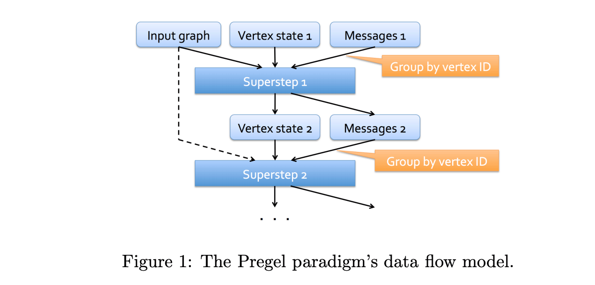
        <figcaption><a href="http://stanford.edu/~rezab/dao/">CME 323: Distributed Algorithms and Optimization, Reza Zadeh, Databricks and Stanford</a></figcaption>
    </figure>
</center>

Computation proceeds in a series of **supersteps**. In each superstep:

1. **Compute**: Every active vertex executes its function, reading messages from the previous superstep
2. **Communicate**: Vertices send messages along their edges to neighbors
3. **Barrier**: The system synchronizes — no vertex proceeds to the next superstep until all vertices have finished the current one

<center>
    <figure>
        
        <figcaption>The BSP model: Compute → Communicate → Barrier, repeated until convergence</figcaption>
    </figure>
</center>

This barrier synchronization is what makes Pregel algorithms easy to reason about. At any point during execution, you know that all vertices are in the same superstep. There are no race conditions, no stale reads, no distributed coordination headaches. You trade some potential parallelism for massive simplification of the programming model.

<center>
    <figure>
        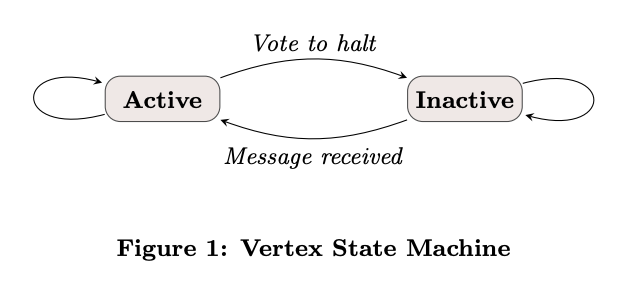
        <figcaption>Vertex state machine from the <a href="https://15799.courses.cs.cmu.edu/fall2013/static/papers/p135-malewicz.pdf">Pregel paper</a>: vertices alternate between active and inactive states</figcaption>
    </figure>
</center>

Vertices can **vote to halt** — marking themselves inactive. An inactive vertex is woken up when it receives a new message. When all vertices have voted to halt and there are no messages in transit, the algorithm terminates. This is how Pregel algorithms converge: vertices stop updating when their state stabilizes.

<center>
    <figure>
        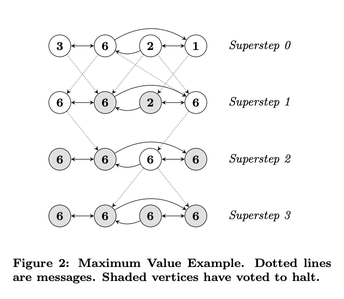
        <figcaption>Superstep progression from the <a href="https://15799.courses.cs.cmu.edu/fall2013/static/papers/p135-malewicz.pdf">Pregel paper</a>: vertices send messages and receive them in the next superstep</figcaption>
    </figure>
</center>


## The Power of Local Computation

Pregel's "think like a vertex" paradigm is a profound shift from how most engineers approach graph problems. When you sit down with a graph database and write a Cypher or Gremlin query, you're thinking *globally* — "find all paths from A to B," "count triangles in the graph," "return the top-10 most central nodes." These are global questions that require the system to traverse large portions of the graph.

In Pregel, you think *locally*. Your vertex function sees only:
- The vertex's own state (its column values)
- The aggregated messages from the previous superstep
- The edges connecting it to neighbors (via the triplet structure)

From this limited local view, global solutions emerge through *iteration*. PageRank doesn't require any vertex to know the entire graph topology — each vertex just needs to know its own PageRank value and out-degree. Through repeated rounds of message passing, the globally correct PageRank values emerge from purely local computations.

This local-to-global property is what makes Pregel algorithms scalable. Each vertex's computation is independent and can run in parallel. The only synchronization point is the barrier between supersteps. This is fundamentally different from graph databases, which often require global locking or distributed transactions for complex queries.

At its heart, Pregel is bulk synchronous parallel processing applied to graphs — or as [Dean and Ghemawat (2004)](https://static.googleusercontent.com/media/research.google.com/en//archive/mapreduce-osdi04.pdf) might put it, it is MapReduce adapted for the structure of graph data, where the "map" operation is vertex computation and the "reduce" operation is message aggregation.


## Why Pregel?

You might wonder: when do I need Pregel instead of GraphFrames' built-in algorithms like `pageRank()` or `connectedComponents()`?

**Pregel is for when the built-in algorithms are not enough.** It is a general-purpose framework for writing *any* iterative graph algorithm. The built-in algorithms are themselves implemented using Pregel (or equivalent message-passing primitives) under the hood.

Pregel excels at problems that require:

- **Iterative convergence**: Algorithms where vertex states evolve over multiple rounds until they stabilize (PageRank, label propagation, belief propagation)
- **Multi-hop information flow**: Information that needs to propagate more than one edge hop from its source (shortest paths, influence propagation, connected components)
- **Custom domain logic**: Graph computations specific to your domain that no library provides out of the box (reputation scoring, custom centrality metrics, anomaly propagation)

Pregel is *not* the right tool for:

- **Single-pass aggregations**: If you just need to count neighbors or sum edge weights once, use @:pydoc(graphframes.GraphFrame.aggregateMessages) instead
- **Pattern matching**: If you're looking for structural patterns, use [motif finding](02-motif-tutorial.md)
- **Non-graph problems**: If your data doesn't have graph structure, use regular Spark DataFrames


## The GraphFrames Pregel API

GraphFrames implements Pregel as a DataFrame-based API with a builder pattern. Here is the general structure:

```python
from graphframes.lib import Pregel

result = graph.pregel \
    .setMaxIter(n) \
    .withVertexColumn("state", initial_expr, update_expr) \
    .sendMsgToDst(message_expr) \
    .aggMsgs(aggregation_expr) \
    .run()
```

Each part maps directly to the Pregel model:

| Method | Purpose | Pregel Concept |
|--------|---------|----------------|
| `setMaxIter(n)` | Maximum supersteps | Termination condition |
| `withVertexColumn(name, init, update)` | Define vertex state | Vertex function |
| `sendMsgToDst(expr)` / `sendMsgToSrc(expr)` | Define messages | Edge communication |
| `aggMsgs(expr)` | Aggregate messages per vertex | Message combining |
| `run()` | Execute the algorithm | Superstep loop |

The key insight is that everything is expressed as **Spark SQL column expressions**. You don't write Python loops or callbacks — you describe *what* to compute, and Spark's optimizer figures out *how* to execute it efficiently across your cluster.

For full API details, see the @:pydoc(graphframes.lib.Pregel) Python documentation and the @:scaladoc(org.graphframes.lib.Pregel) Scala documentation.


## How GraphFrames Implements Pregel Under the Hood

It helps to understand what happens when you call `.run()`. The implementation in @:scaladoc(org.graphframes.lib.Pregel) translates the Pregel model into DataFrame operations:

1. **Initialize**: The vertices DataFrame is expanded with the initial values of all `withVertexColumn` definitions, plus an internal active flag column.

2. **Build triplets**: For each iteration, GraphFrames constructs **triplets** — DataFrames where each row contains a source vertex, an edge, and a destination vertex. These triplets are what make `Pregel.src()`, `Pregel.dst()`, and `Pregel.edge()` references work in your message expressions.

3. **Generate messages**: The message expressions (`sendMsgToDst`, `sendMsgToSrc`) are evaluated over the triplets, producing a DataFrame of (target_vertex_id, message) pairs. Null messages are automatically filtered out.

4. **Aggregate**: Messages are grouped by target vertex ID and aggregated using the `aggMsgs` expression.

5. **Update**: The aggregated messages are LEFT-OUTER joined with the current vertices. The update expressions in `withVertexColumn` are evaluated, producing the new vertex state. Vertices that received no messages see `null` for `Pregel.msg()`.

6. **Checkpoint**: Every `checkpointInterval` iterations (default: 2), the vertex DataFrame is checkpointed to prevent the Spark query plan from growing linearly with the number of iterations. Without this, Spark would build a plan with hundreds of joins for a 50-iteration algorithm, which would crash the driver.

7. **Termination check**: If early stopping or vertex voting is enabled, a Spark action is triggered to check the condition.

**Automatic optimization**: GraphFrames analyzes your message expressions to determine if the destination vertex state is actually needed. If your messages only reference `Pregel.src()` and `Pregel.edge()` columns (not `Pregel.dst()`), the implementation skips the second join entirely — a significant performance optimization for algorithms like PageRank.

Understanding this implementation helps you write better Pregel algorithms. For example:
- **Avoid referencing `Pregel.dst()` unless necessary** — it triggers an extra join
- **Keep vertex schemas narrow** — wide schemas mean larger triplets
- **Use `required_src_columns` / `required_dst_columns`** to reduce shuffle data


# Data Setup

**⚠️ Before continuing**: If you haven't already, complete the [Data Setup Tutorial](03-data-setup.md) to download the Stack Exchange dataset and convert it to Parquet files. The examples in this tutorial require the `Nodes.parquet` and `Edges.parquet` files to be ready.

The Stack Exchange graph contains ~130K nodes (Users, Questions, Answers, Votes, Badges, Tags, PostLinks) and ~97K edges across 8 relationship types. It is small enough to run on a laptop but complex enough to demonstrate real graph algorithms.

Let's load the data and create our `GraphFrame`:

```python
import pyspark.sql.functions as F
from pyspark.sql import DataFrame, SparkSession
from graphframes import GraphFrame

spark: SparkSession = (
    SparkSession.builder.appName("Pregel Tutorial")
    .config("spark.sql.caseSensitive", True)
    .getOrCreate()
)
spark.sparkContext.setCheckpointDir("/tmp/graphframes-checkpoints/pregel")

STACKEXCHANGE_SITE = "stats.meta.stackexchange.com"
BASE_PATH = f"python/graphframes/tutorials/data/{STACKEXCHANGE_SITE}"

nodes_df: DataFrame = spark.read.parquet(f"{BASE_PATH}/Nodes.parquet")
nodes_df = nodes_df.repartition(50).checkpoint().cache()

edges_df: DataFrame = spark.read.parquet(f"{BASE_PATH}/Edges.parquet")
edges_df = edges_df.repartition(50).checkpoint().cache()

g = GraphFrame(nodes_df, edges_df)
```


# Example 1: Degree Centrality with AggregateMessages

Before diving into Pregel, let's build intuition with a simpler API: @:pydoc(graphframes.GraphFrame.aggregateMessages). AggregateMessages performs a **single pass** of message sending and aggregation — no iterations, no evolving state. It is the right tool for simple, one-shot graph aggregations.

The most basic graph metric is **in-degree**: how many edges point to each vertex. In our Stack Exchange graph, a User's in-degree tells us how many badges they've earned, a Question's in-degree tells us how many answers and votes it has received, and so on.

<center>
    <figure>
        
        <figcaption>AggregateMessages: each source sends 1 to its destination, destinations sum their messages</figcaption>
    </figure>
</center>

```python
from graphframes.lib import AggregateMessages as AM

am_in_degrees = g.aggregateMessages(
    F.count(AM.msg).alias("in_degree"),
    sendToDst=F.lit(1),
)
```

There is a subtlety here: vertices with no incoming edges (in-degree = 0) won't appear in the results at all, because they received no messages. We fix this with a LEFT JOIN:

```python
complete_in_deg = (
    g.vertices.select("id", "Type")
    .join(am_in_degrees, on="id", how="left")
    .na.fill(0, ["in_degree"])
)

complete_in_deg.groupBy("in_degree").count().orderBy("in_degree").show(10)
```

```
+---------+-----+
|in_degree|count|
+---------+-----+
|        0|81735|
|        1|43165|
|        2|  341|
|        3|  218|
|        4|  289|
|        5|  326|
|        6|  371|
|        7|  318|
|        8|  338|
|        9|  304|
+---------+-----+
```

Most nodes have zero in-degree (they are source-only nodes like Votes that cast votes but don't receive edges). The distribution follows a power law, which is typical for real-world networks. The power law means that a few nodes have very high in-degree (popular questions with hundreds of votes, prolific users with thousands of badges) while the vast majority have low in-degree.

Let's look at who has the highest in-degree:

```python
complete_in_deg.orderBy(F.desc("in_degree")).show(10)
```

In our Stack Exchange graph, the highest in-degree nodes are typically Questions that have attracted many votes, answers, and tags. This is exactly what we'd expect — Questions are the focal points of a Q&A network. They accumulate relationships from answers, votes, tags, and links.

AggregateMessages is clean and efficient for this kind of single-pass aggregation. But what if we need to compute something that requires *multiple iterations* — where vertex state evolves based on neighbor states over time? That's where Pregel comes in.


# Example 2: Degree Centrality with Pregel

Let's compute the same in-degree metric using Pregel. This is intentionally over-engineered for a single-pass problem, but it gives us a minimal working example to learn the API before we tackle algorithms that *need* multiple iterations.

<center>
    <figure>
        
        <figcaption>Pregel in-degree: initialize to 0, send 1 along each edge, sum at destination</figcaption>
    </figure>
</center>

```python
from graphframes.lib import Pregel

pregel_in_degree = g.pregel \
    .setMaxIter(1) \
    .withVertexColumn(
        "in_degree",
        F.lit(0),                              # Initial value: start at 0
        F.coalesce(Pregel.msg(), F.lit(0))     # Update: use message or keep 0
    ) \
    .sendMsgToDst(F.lit(1)) \
    .aggMsgs(F.sum(Pregel.msg())) \
    .run()
```

Let's break down each part:

**`setMaxIter(1)`**: Run for exactly one superstep. Degree only needs a single round of message passing.

**`withVertexColumn("in_degree", F.lit(0), F.coalesce(Pregel.msg(), F.lit(0)))`**: This defines a new vertex column called `in_degree`. The second argument (`F.lit(0)`) is the **initial value** — every vertex starts with degree 0. The third argument is the **update expression** — after messages are aggregated, set `in_degree` to the aggregated message value, or 0 if no messages arrived. `Pregel.msg()` references the aggregated message column.

**`sendMsgToDst(F.lit(1))`**: For every edge in the graph, send the integer value `1` from source to destination. This is the message expression — it can reference source vertex columns with `Pregel.src("col")`, destination vertex columns with `Pregel.dst("col")`, and edge columns with `Pregel.edge("col")`.

**`aggMsgs(F.sum(Pregel.msg()))`**: For each vertex, sum all received messages. `Pregel.msg()` here references the individual (unaggregated) message column. You can use any Spark aggregation function: `sum`, `min`, `max`, `collect_list`, etc.

**`run()`**: Execute the algorithm and return a DataFrame with the original vertex columns plus the new `in_degree` column.

Notice the key difference from AggregateMessages: Pregel **automatically handles zero-degree vertices**. Because `withVertexColumn` initializes every vertex to 0 and the update expression uses `F.coalesce(Pregel.msg(), F.lit(0))`, vertices that receive no messages keep their initial value of 0. No LEFT JOIN needed.

## AggregateMessages vs. Pregel

| Feature | AggregateMessages | Pregel |
|---------|-------------------|--------|
| **Iterations** | Single pass only | Multiple with `setMaxIter()` |
| **Vertex State** | Manual (pre-create columns) | Automatic (`withVertexColumn`) |
| **Zero-degree nodes** | Dropped (need LEFT JOIN) | Handled via initial values |
| **Syntax** | Functional, lower-level | Builder pattern, declarative |
| **Best For** | One-off aggregations | Iterative algorithms |

For simple metrics like degree, either API works. For everything that follows, Pregel is the only option.


# Example 3: PageRank with Pregel

PageRank is the algorithm that launched Google. Defined by Larry Page and Sergey Brin in their 1998 paper [The PageRank Citation Ranking: Bringing Order to the Web](https://www.cis.upenn.edu/~mkearns/teaching/NetworkedLife/pagerank.pdf), it computes the "importance" of each node based on the importance of nodes linking to it. The key insight: **a node is important if important nodes point to it**.

<center>
    <figure>
        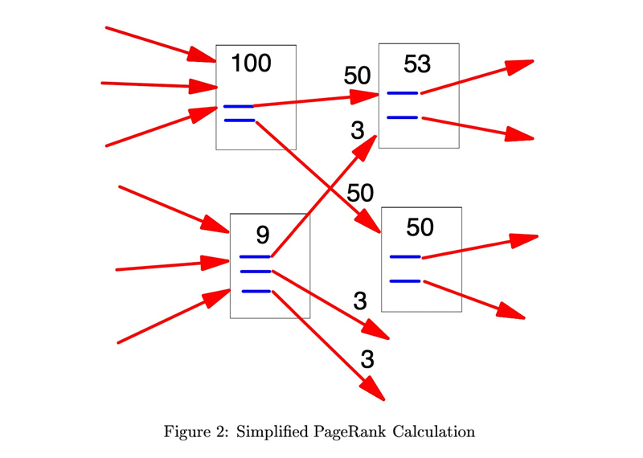
        <figcaption>A simplified PageRank calculation, from the <a href="https://www.cis.upenn.edu/~mkearns/teaching/NetworkedLife/pagerank.pdf">PageRank paper</a></figcaption>
    </figure>
</center>

The PageRank formula for a vertex `v` is:

```
PR(v) = (1 - d) / N + d × Σ(PR(u) / out_degree(u))
```

where `d` is the damping factor (typically 0.85), `N` is the total number of vertices, and the sum is over all vertices `u` that have an edge pointing to `v`.

This is a natural fit for Pregel:
- Each vertex maintains its current PageRank value (vertex state)
- Each vertex sends `PR / out_degree` to its neighbors (messages)
- Each vertex updates its PageRank using the damping formula (update function)
- Repeat for multiple iterations until convergence

<center>
    <figure>
        
        <figcaption>PageRank values evolving over iterations: each vertex sends PR/out_degree along its edges</figcaption>
    </figure>
</center>

First, we need to compute out-degrees (each vertex needs to know how many outgoing edges it has):

```python
out_degrees = g.outDegrees.withColumnRenamed("outDegree", "out_degree")
pr_vertices = (
    nodes_df.join(out_degrees, on="id", how="left")
    .na.fill(1, ["out_degree"])
)
g_pr = GraphFrame(pr_vertices, edges_df)

num_vertices = g_pr.vertices.count()
damping = 0.85
max_iter = 10
```

Now the Pregel PageRank implementation:

```python
pr_results = g_pr.pregel \
    .setMaxIter(max_iter) \
    .withVertexColumn(
        "pagerank",
        F.lit(1.0 / num_vertices),
        F.coalesce(Pregel.msg(), F.lit(0.0)) * F.lit(damping)
            + F.lit((1.0 - damping) / num_vertices)
    ) \
    .sendMsgToDst(
        Pregel.src("pagerank") / Pregel.src("out_degree")
    ) \
    .aggMsgs(F.sum(Pregel.msg())) \
    .run()
```

**Initialization**: Every vertex starts with `1/N` — uniform initial importance.

**Message**: Each vertex sends `pagerank / out_degree` to each of its destination vertices. This splits the vertex's importance equally among its outgoing edges. `Pregel.src("pagerank")` references the source vertex's current `pagerank` column, and `Pregel.src("out_degree")` references its out-degree.

**Aggregation**: Sum all incoming PageRank contributions.

**Update**: Apply the damping formula. The `(1 - d) / N` term ensures that every vertex receives a small base amount of PageRank, preventing rank sinks.

Let's see the top Questions and Users by PageRank:

```python
pr_results.filter(F.col("Type") == "Question") \
    .select("id", "Title", "pagerank") \
    .orderBy(F.desc("pagerank")) \
    .show(10, truncate=50)
```

The top-ranked nodes in a knowledge graph reveal its structure. In Stack Exchange, highly-ranked Users are those who receive many votes on their answers, which in turn point to highly-ranked Questions. Tags that are applied to important questions accumulate PageRank transitively. This is the recursive nature of PageRank — importance flows through the graph topology.

Experiment with different `max_iter` values. You'll find that PageRank converges quickly — most of the "work" happens in the first 5-6 iterations, with diminishing changes afterward. This is because the damping factor causes the influence of distant nodes to decay exponentially with distance.

## Comparing with Built-in PageRank

GraphFrames provides a built-in `pageRank()` method. Let's compare the **rankings** — the absolute PageRank values may differ due to normalization, but the relative ordering of vertices should be very similar:

```python
from pyspark.sql import Window

builtin_pr = g.pageRank(resetProbability=1 - damping, maxIter=max_iter)

# Compare rankings rather than absolute values
pregel_ranked = (
    pr_results.select("id", F.col("pagerank").alias("pregel_pr"))
    .withColumn("pregel_rank", F.dense_rank().over(
        Window.orderBy(F.desc("pregel_pr"))
    ))
)
builtin_ranked = (
    builtin_pr.vertices.select("id", F.col("pagerank").alias("builtin_pr"))
    .withColumn("builtin_rank", F.dense_rank().over(
        Window.orderBy(F.desc("builtin_pr"))
    ))
)
comparison = pregel_ranked.join(builtin_ranked, on="id")
rank_corr = comparison.stat.corr("pregel_rank", "builtin_rank")
print(f"Rank correlation: {rank_corr:.4f}")
```

The rank correlation should be very high (close to 1.0), confirming that both implementations agree on which nodes are important even if the absolute PageRank values differ. The built-in PageRank may use different normalization internally, but the ranking — which is what matters in practice — is essentially the same.

The built-in PageRank also supports **convergence tolerance** via `tol` parameter — it stops early when the maximum change in any vertex's PageRank drops below the tolerance. Our Pregel implementation uses a fixed iteration count, but you could add tolerance-based convergence using the vertex voting mechanism (see the Advanced Topics section).


# Example 4: Connected Components with Pregel

Connected components identifies groups of vertices that are reachable from each other. It is one of the most fundamental graph algorithms — a building block for community detection, data quality checks, and graph decomposition.

The algorithm is elegantly simple in Pregel:

1. Each vertex starts with its own ID as its component label
2. Each vertex sends its current label to all neighbors (both directions)
3. Each vertex adopts the **minimum** label it receives
4. Repeat until no labels change

After convergence, all vertices in the same connected component will have the same label — the minimum ID among all vertices in that component.

<center>
    <figure>
        
        <figcaption>Connected components: minimum labels propagate through each component until convergence</figcaption>
    </figure>
</center>

```python
cc_vertices = g.vertices.select("id")
cc_graph = GraphFrame(cc_vertices, g.edges.select("src", "dst"))

cc_results = cc_graph.pregel \
    .setMaxIter(20) \
    .setEarlyStopping(True) \
    .withVertexColumn(
        "component",
        F.col("id"),
        F.least(
            F.col("component"),
            F.coalesce(Pregel.msg(), F.col("component"))
        )
    ) \
    .sendMsgToDst(Pregel.src("component")) \
    .sendMsgToSrc(Pregel.dst("component")) \
    .aggMsgs(F.min(Pregel.msg())) \
    .run()
```

Several important patterns here:

**Bidirectional messaging**: We use *both* `sendMsgToDst()` and `sendMsgToSrc()`. Directed edges in our graph become undirected for connected components — if A can reach B, then B can reach A. This is a common pattern for algorithms that treat the graph as undirected.

**Early stopping**: `setEarlyStopping(True)` tells Pregel to halt when no non-null messages are produced. Once all labels have converged, no vertex sends messages with a smaller label, and the algorithm terminates before reaching `maxIter`. This is a significant optimization — for many graphs, connected components converges in far fewer than 20 iterations.

**Monotonic convergence**: The `F.least()` update ensures labels can only decrease. This guarantees convergence: in the worst case, the minimum ID in each component propagates to every vertex in that component, and no vertex can ever "go backward" to a larger label.

```python
num_components = cc_results.select("component").distinct().count()
print(f"Number of connected components: {num_components:,}")

cc_results.groupBy("component").count() \
    .orderBy(F.desc("count")) \
    .show(10)
```

In the Stack Exchange graph, you'll typically find one giant component (most nodes are connected through the question-answer-user chain) plus many small components (isolated votes, orphaned badges, etc.).

## How Fast Does It Converge?

The convergence speed of connected components depends on the **diameter** of the graph — the longest shortest path between any two connected vertices. In the worst case (a linear chain of N vertices), it takes N-1 supersteps. In practice, real-world graphs have small diameters due to the [small-world property](https://en.wikipedia.org/wiki/Small-world_network), so convergence is fast.

The early stopping optimization is crucial here. Without it, Pregel would run all 20 iterations even after convergence. With it, the algorithm halts as soon as the minimum labels stop propagating — which often happens in 5-10 iterations for real-world social graphs.

You can verify convergence speed by adding some logging. Run with a few different `maxIter` values and compare the results — you'll find the same component labels regardless of whether you set `maxIter` to 10, 20, or 100, as long as it's high enough.

## A Note on the Built-in Algorithm

GraphFrames provides `g.connectedComponents()` which uses a more sophisticated implementation with checkpointing and GraphX integration. For production workloads, the built-in version may be faster due to its optimizations. But the Pregel version is instructive and can be customized — for example, you could add type-aware component detection where edges of certain types are ignored.


# Example 5: Shortest Paths with Pregel

Single-source shortest paths computes the minimum number of hops from a source vertex to every other vertex in the graph. In our Stack Exchange graph, this tells us the network distance between entities: how many relationship hops separate a given question from any user, answer, tag, or vote in the network.

The algorithm is a Pregel adaptation of breadth-first search:

1. The source vertex starts with distance 0; all others start at infinity
2. Each vertex with a finite distance sends `distance + 1` to its neighbors
3. Each vertex takes the minimum of its current distance and incoming messages
4. Repeat until no distances improve

<center>
    <figure>
        
        <figcaption>Shortest paths from source A: distances propagate outward, one hop per superstep</figcaption>
    </figure>
</center>

```python
# Pick the most-viewed question as our source
popular_question = (
    nodes_df.filter(F.col("Type") == "Question")
    .orderBy(F.desc("ViewCount"))
    .select("id", "Title")
    .first()
)
source_id = popular_question["id"]

sp_vertices = g.vertices.select("id")
sp_graph = GraphFrame(sp_vertices, g.edges.select("src", "dst"))

INF = 999999  # Represents unreachable

sp_results = sp_graph.pregel \
    .setMaxIter(10) \
    .setEarlyStopping(True) \
    .withVertexColumn(
        "distance",
        F.when(F.col("id") == source_id, F.lit(0)).otherwise(F.lit(INF)),
        F.least(
            F.col("distance"),
            F.coalesce(Pregel.msg(), F.lit(INF))
        )
    ) \
    .sendMsgToDst(
        F.when(
            Pregel.src("distance") < F.lit(INF),
            Pregel.src("distance") + F.lit(1)
        )
    ) \
    .sendMsgToSrc(
        F.when(
            Pregel.dst("distance") < F.lit(INF),
            Pregel.dst("distance") + F.lit(1)
        )
    ) \
    .aggMsgs(F.min(Pregel.msg())) \
    .run()
```

Key patterns:

**Conditional messaging**: The `F.when(Pregel.src("distance") < F.lit(INF), ...)` guard ensures that only vertices with finite distances send messages. Vertices that haven't been reached yet don't waste computation sending infinity + 1. `null` messages are automatically filtered by Pregel.

**Bidirectional again**: We send messages in both directions to treat the graph as undirected for reachability. If you want directed shortest paths, use only `sendMsgToDst`.

**BFS-like expansion**: Each superstep extends the frontier by one hop. The distance distribution tells us the structure of the graph: how quickly information can flow through the network.

```python
sp_results.filter(F.col("distance") < INF) \
    .groupBy("distance").count() \
    .orderBy("distance").show(20)
```

The distance distribution reveals the [small-world property](https://en.wikipedia.org/wiki/Small-world_network) of the Stack Exchange graph. Most vertices are reachable within a handful of hops.

## Understanding the Wavefront

Shortest paths in Pregel is essentially BFS implemented as message passing. The algorithm creates an expanding **wavefront**: at superstep 1, all direct neighbors of the source get distance 1. At superstep 2, their neighbors get distance 2. And so on, one hop per superstep.

This wavefront property is why the distance distribution is so informative. Each row in the distribution corresponds to one superstep's work. If distance 3 has the most vertices, it means the third ring of neighbors from the source is the densest — which tells you something about the graph's local structure around your source vertex.

In our Stack Exchange graph, the source question connects directly (distance 1) to its answers, the users who asked it, tags applied to it, and votes cast on it. At distance 2, we reach the badges those users have, other questions they've asked, other answers to the same question, and so on. By distance 3-4, we've typically reached most of the connected graph.

The `INF` value we use (999999) is a practical choice. A more mathematically pure implementation would use `None`/null, but nulls in Spark column expressions require more careful handling with `coalesce`. The large integer approach is simpler and works correctly as long as your graph has fewer than 999,999 vertices in any path — which is true for virtually all real-world graphs.

## Advanced: Memory Optimization

For large graphs with many vertex columns, Pregel constructs triplets (source vertex + edge + destination vertex) that can be memory-intensive. GraphFrames provides `required_src_columns()` and `required_dst_columns()` to specify which columns are actually needed:

```python
sp_graph.pregel \
    .setMaxIter(10) \
    .withVertexColumn("distance", ..., ...) \
    .sendMsgToDst(Pregel.src("distance") + F.lit(1)) \
    .required_src_columns("distance") \
    .required_dst_columns("distance") \
    .aggMsgs(F.min(Pregel.msg())) \
    .run()
```

The `id` column and active flag are always included automatically. This optimization can dramatically reduce memory usage for graphs with wide vertex schemas (like our Stack Exchange graph with 50+ columns).


# Example 6: Reputation Propagation

Now we get to the real power of Pregel: **algorithms that don't exist as built-in functions.** This is where vertex-centric thinking pays off.

In Stack Exchange, users have reputation scores that reflect their trustworthiness and expertise. But reputation is an attribute of *users*, not of the *questions they answer*. What if we want to know which questions have been answered by the most reputable users? Which questions have attracted the most expert attention?

This is a **reputation propagation** algorithm — a form of trust propagation through a network. The concept has roots in the [EigenTrust algorithm](https://nlp.stanford.edu/pubs/eigentrust.pdf) (Kamvar et al., 2003) for peer-to-peer networks and in [trust propagation research](https://www.sciencedirect.com/science/article/pii/S2212017312006093) for social networks. The core idea is that trust or authority flows through edges, accumulating at destination nodes.

<center>
    <figure>
        
        <figcaption>Reputation flows from Users through Answers to Questions over 2 Pregel supersteps</figcaption>
    </figure>
</center>

Here's why this requires Pregel: the reputation must flow **two hops** — from User to Answer to Question. A single-pass AggregateMessages can only propagate information one hop. You could chain two AggregateMessages calls manually, but Pregel handles multi-hop propagation natively with `setMaxIter(2)`.

We build a subgraph focused on the reputation flow path:

```python
# User nodes with their reputation scores
user_nodes = nodes_df.filter(F.col("Type") == "User").select(
    "id",
    F.col("Reputation").cast("double").alias("reputation"),
    F.lit("User").alias("Type")
)

# Answer nodes with their scores
answer_nodes = nodes_df.filter(F.col("Type") == "Answer").select(
    "id",
    F.col("Score").cast("double").alias("score"),
    F.lit("Answer").alias("Type")
)

# Question nodes
question_nodes = nodes_df.filter(F.col("Type") == "Question").select(
    "id",
    F.col("ViewCount").cast("double").alias("views"),
    F.lit("Question").alias("Type")
)

# Build unified vertex DataFrame
rep_vertices = (
    user_nodes.withColumn("score", F.lit(0.0)).withColumn("views", F.lit(0.0))
    .unionByName(
        answer_nodes.withColumn("reputation", F.lit(0.0))
        .withColumn("views", F.lit(0.0))
    )
    .unionByName(
        question_nodes.withColumn("reputation", F.lit(0.0))
        .withColumn("score", F.lit(0.0))
    )
    .na.fill(0.0)
)

# Edges: User->Answer (Posts) and Answer->Question (Answers)
posts_edges = edges_df.filter(F.col("relationship") == "Posts").select("src", "dst")
answers_edges = edges_df.filter(F.col("relationship") == "Answers").select("src", "dst")
rep_edges = posts_edges.unionByName(answers_edges)

rep_graph = GraphFrame(rep_vertices, rep_edges)
```

Now the Pregel propagation:

```python
rep_results = rep_graph.pregel \
    .setMaxIter(2) \
    .withVertexColumn(
        "authority",
        F.col("reputation"),  # Users start with their rep; others start at 0
        F.coalesce(Pregel.msg(), F.lit(0.0)) + F.col("authority")
    ) \
    .sendMsgToDst(
        F.when(
            Pregel.src("authority") > F.lit(0),
            Pregel.src("authority")
        )
    ) \
    .aggMsgs(F.sum(Pregel.msg())) \
    .run()
```

**Iteration 1**: Users send their reputation scores to the Answers they posted. Each Answer accumulates the reputation of its author.

**Iteration 2**: Answers (now carrying their author's reputation) send their authority to the Questions they answer. Each Question accumulates the total reputation of all its answerers.

The result is an "authority" score for each Question that reflects the collective expertise of its answer pool. This is a metric you cannot compute with a simple SQL join — it requires understanding the graph topology and propagating values through it.

To understand the subtlety here, consider what happens if you try to compute this *without* Pregel. You could join Users with Answers (via the "Posts" relationship) and then join Answers with Questions (via the "Answers" relationship), summing reputation along the way. That's a two-hop join, which is possible in SQL. But what if you wanted reputation to flow *three* hops — through answers to linked questions? Or four hops? Each additional hop requires another join, and the query plan grows quadratically in complexity. Pregel handles arbitrary hop counts by simply increasing `setMaxIter`.

More importantly, Pregel allows the propagation to be *stateful*. In our example, each Answer accumulates its author's reputation before forwarding it. With joins, you'd need to pre-compute intermediate results and manage them manually. Pregel's vertex state makes this natural.

This is the key pattern that makes Pregel invaluable for custom graph algorithms: **multi-hop, stateful information propagation**. Graph databases can do BFS. SQL can do joins. But neither handles iterative, stateful propagation as cleanly as Pregel.

```python
top_questions = (
    rep_results.filter(F.col("Type") == "Question")
    .select("id", "authority")
    .join(
        nodes_df.filter(F.col("Type") == "Question")
        .select("id", "Title", "ViewCount"),
        on="id"
    )
    .orderBy(F.desc("authority"))
)
top_questions.show(10, truncate=60)
```

The highest-authority questions are those answered by the most reputable community members — which often (but not always!) correlates with view count. Divergences between view count and authority reveal questions that are popular but underserved by experts, or niche questions that attracted top-tier answers.


# Designing Your Own Pregel Algorithm

Now that we have five algorithms under our belt, let's step back and develop a systematic approach to designing new Pregel algorithms. The goal is to give you a mental framework you can apply to any graph problem you encounter.

## The Four-Question Framework

Every Pregel algorithm answers four questions. Let's walk through how to answer them for a hypothetical new problem: **computing the average answer score for each tag in the Stack Exchange graph**. Tags connect to Questions, Questions connect to Answers, and Answers have scores. We want each Tag to know the average score of all Answers to its tagged Questions.

**Question 1: What vertex state do I need?**

Each Tag needs to accumulate (a) the total score of answers to its questions and (b) the count of such answers. Each vertex gets two columns: `total_score` and `answer_count`. Tags initialize both to 0. Answers initialize `total_score` to their own score and `answer_count` to 1. Questions and other node types initialize to 0.

**Question 2: What messages should neighbors exchange?**

The information needs to flow: Answer → Question → Tag. Answers send their (score, count) to the Questions they answer. Questions forward the accumulated (score, count) to their Tags. This is a two-hop propagation, like reputation propagation.

**Question 3: How do messages combine?**

When a Question receives scores from multiple Answers, it sums both the scores and the counts. When a Tag receives from multiple Questions, it sums again. The aggregation is `sum` for both fields.

**Question 4: How does state update?**

After receiving messages, each vertex adds the incoming total to its own total and the incoming count to its own count. The final average is `total_score / answer_count`, computed after Pregel completes.

The implementation would use `setMaxIter(2)` with a struct message containing both fields, or equivalently, two separate `withVertexColumn` definitions — one for total and one for count. This decomposition process works for any graph problem that involves information propagation.

## Common Algorithm Templates

Most Pregel algorithms fall into a few templates:

**Propagation** (PageRank, reputation): Vertex values flow outward along edges and accumulate. Each vertex updates its state based on the sum (or weighted sum) of incoming values. Converges through damping or fixed iterations.

**Label spreading** (connected components, community detection): Vertices adopt labels from their neighbors using a consensus rule (minimum, majority, random). Converges when labels stabilize.

**Frontier expansion** (shortest paths, BFS): A wavefront of "active" vertices expands outward from seed vertices. Each superstep extends the frontier by one hop. Converges when the frontier can't expand further.

**Belief propagation** (probabilistic inference): Vertices exchange probability distributions and update their beliefs based on Bayesian inference rules. Used in graphical model inference and recommendation systems.

Recognizing which template fits your problem is half the battle. The other half is handling the edge cases: null messages, zero-degree vertices, convergence criteria, and the inevitable off-by-one error in your message expression.


# Example 7: Debug Trace — Understanding Pregel's Mechanics

When developing a new Pregel algorithm, it is invaluable to see exactly what messages flow where and how vertex state evolves. This example is purely educational: we track the path of messages through a small test graph to make the message-passing mechanics visible.

<center>
    <figure>
        
        <figcaption>Message path tracing: each vertex records where its information came from</figcaption>
    </figure>
</center>

```python
# Small test graph for clarity
test_vertices = spark.createDataFrame(
    [("A", "Alice"), ("B", "Bob"), ("C", "Charlie"), ("D", "David")],
    ["id", "name"],
)
test_edges = spark.createDataFrame(
    [("A", "B"), ("A", "C"), ("B", "C"), ("C", "D")],
    ["src", "dst"],
)
test_graph = GraphFrame(test_vertices, test_edges)

trace_results = test_graph.pregel \
    .setMaxIter(3) \
    .withVertexColumn(
        "trace",
        F.col("id"),
        F.concat_ws(
            " <- ",
            F.coalesce(Pregel.msg(), F.lit("")),
            F.col("id")
        )
    ) \
    .sendMsgToDst(Pregel.src("trace")) \
    .aggMsgs(
        F.concat_ws(" | ", F.collect_list(Pregel.msg()))
    ) \
    .run()

trace_results.select("id", "name", "trace").orderBy("id").show(truncate=False)
```

Each vertex's `trace` column shows who influenced it. Reading right-to-left: `X <- Y <- Z` means Z's state flowed through Y to reach X. The `|` separator shows independent paths arriving at the same vertex.

This is a debugging technique. When you're developing a new algorithm and the results don't look right, add a trace column to see exactly what messages each vertex receives and how they aggregate. Once the algorithm works, remove the trace.

## Debugging Tips for Custom Algorithms

When your Pregel algorithm produces unexpected results, here is a systematic debugging approach:

1. **Start with a small graph** (4-6 vertices) where you can compute the expected results by hand.

2. **Add a trace column** like Example 7 to see exactly what messages flow where. String concatenation with `concat_ws` and `collect_list` makes message flows visible.

3. **Run one iteration at a time** by setting `setMaxIter(1)`, then `setMaxIter(2)`, etc. Compare the intermediate results with your manual calculations.

4. **Check for null handling**. The most common bug in Pregel algorithms is incorrect null handling. Remember: `Pregel.msg()` is null when a vertex receives no messages. Your update expression must handle this case explicitly, usually with `F.coalesce(Pregel.msg(), default_value)`.

5. **Verify message direction**. `sendMsgToDst` sends from source to destination (following the edge direction). `sendMsgToSrc` sends from destination to source (against the edge direction). For undirected algorithms, you need both.

6. **Check aggregation semantics**. `F.sum()` treats nulls as zero. `F.min()` ignores nulls. `F.collect_list()` excludes nulls. Make sure your aggregation function does what you expect.

7. **Watch for zero-degree vertices**. Vertices with no incoming messages won't trigger the update expression (they'll see `null` for `Pregel.msg()`). Make sure your initial values and update expressions handle this correctly.

These debugging patterns apply to every Pregel algorithm. Internalizing them will save you hours of confusion when developing custom algorithms on real data.


# Advanced Topics

## Convergence Strategies

GraphFrames Pregel provides three ways to control when the algorithm stops:

**`setMaxIter(n)`**: The simplest — run for exactly `n` supersteps. Good for algorithms with known iteration counts (PageRank typically converges in 10-20 iterations).

**`setEarlyStopping(True)`**: Stop when no non-null messages are produced. Good for BFS-like algorithms (shortest paths, connected components) where the frontier eventually stops expanding. *Warning*: checking for empty messages is a Spark action, so it adds overhead per iteration. Don't use for algorithms like PageRank where messages are never null.

**Vertex voting** via `setStopIfAllNonActiveVertices(True)` with `setInitialActiveVertexExpression(expr)` and `setUpdateActiveVertexExpression(expr)`: The most general approach. Each vertex has an active flag. You define expressions for when vertices should be active. When all vertices become inactive, the algorithm terminates. This is closest to the original Pregel paper's "vote to halt" mechanism.

For PageRank with tolerance-based convergence, vertex voting looks like:

```python
graph.pregel \
    .setMaxIter(100) \
    .setStopIfAllNonActiveVertices(True) \
    .setUpdateActiveVertexExpression(
        F.abs(F.col("pagerank") - Pregel.msg()) > F.lit(0.001)
    ) \
    .withVertexColumn("pagerank", ..., ...) \
    ...
```

## Performance Best Practices

**Start with a small graph.** Test your algorithm on a small test graph (like Example 7) before running on the full dataset. This catches logical errors quickly.

**Use `setEarlyStopping(True)` for frontier-based algorithms.** Connected components and shortest paths often converge much faster than `maxIter`. Early stopping avoids wasting computation on empty supersteps.

**Use `setSkipMessagesFromNonActiveVertices(True)` for algorithms with active vertex tracking.** This avoids generating messages from vertices whose state hasn't changed, dramatically reducing message volume for sparse-update algorithms like shortest paths.

**Checkpoint regularly.** Pregel checkpoints every 2 iterations by default (configurable via `setCheckpointInterval`). For long-running algorithms, this prevents Spark's query plan from growing unboundedly. Set a checkpoint directory via `sc.setCheckpointDir("/path")`.

**Consider storage levels.** For very large graphs, use `setIntermediateStorageLevel(StorageLevel.DISK_ONLY)` to avoid OOM errors at the cost of slower iteration.

**Use `required_src_columns` / `required_dst_columns`** when your vertex schema is wide but your message expressions only reference a few columns. This can reduce shuffle data by orders of magnitude.

**Unpersist results.** Pregel returns a persisted DataFrame. Call `.unpersist()` when you're done to free memory:

```python
results = graph.pregel.setMaxIter(10)...run()
# ... use results ...
results.unpersist()
```


## When NOT to Use Pregel

Pregel is powerful, but it's not always the right tool:

- **Single-hop aggregations**: Use `aggregateMessages()` — it's simpler and faster.
- **Graph pattern matching**: Use `g.find()` for motif discovery — Pregel can't express structural patterns.
- **Global statistics**: Pregel is vertex-local. For graph-wide metrics (diameter, global clustering coefficient), you'll need to combine Pregel with regular DataFrame operations.
- **Non-iterative queries**: If you can express it as a single SQL query on vertices and edges, don't add the overhead of Pregel's superstep machinery.


# Conclusion

We covered a lot of ground in this tutorial. Starting from the simplest possible graph metric (in-degree), we progressed through increasingly sophisticated algorithms to custom reputation propagation — an algorithm that doesn't exist in any graph library but was straightforward to implement with Pregel.

Here is the core pattern that every Pregel algorithm follows:

```python
result = graph.pregel \
    .setMaxIter(n) \
    .withVertexColumn("state", initial_value, update_function) \
    .sendMsgToDst(message_expression) \
    .aggMsgs(aggregation_function) \
    .run()
```

The art of Pregel programming is in choosing the right:
- **Vertex state**: What does each vertex need to remember?
- **Messages**: What information do neighbors need to share?
- **Aggregation**: How do multiple messages combine?
- **Update**: How does new information change the vertex's state?

If you can answer these four questions for your problem, you can implement it in Pregel.

## Pattern Library

Here is a summary of the algorithm patterns we implemented, along with their key characteristics. Use this as a reference when designing your own Pregel algorithms:

| Algorithm | Iterations | Message Direction | Aggregation | State Type | Convergence |
|-----------|-----------|-------------------|-------------|------------|-------------|
| In-Degree | 1 | dst only | `sum` | integer | Single pass |
| PageRank | 10-20 | dst only | `sum` | float | Damped iteration |
| Connected Components | variable | both (undirected) | `min` | string/ID | Early stopping |
| Shortest Paths | variable | both (undirected) | `min` | integer | Early stopping |
| Reputation Propagation | 2 | dst only | `sum` | float | Fixed iterations |
| Debug Trace | variable | dst only | `collect_list` + `concat` | string | Fixed iterations |

**Common patterns**:
- Algorithms that converge use `F.least()` or `F.min()` to ensure monotonic state changes
- Undirected algorithms use both `sendMsgToDst` and `sendMsgToSrc`
- Conditional messages use `F.when(..., message).otherwise(None)` to filter
- All algorithms must handle the null-message case in their update expression

## Key Takeaways

1. **Think like a vertex.** Your algorithm is a function that runs at each vertex, seeing only local information and messages from neighbors. Global behavior emerges from local interactions.

2. **Pregel handles the hard parts.** Distribution, synchronization, fault tolerance, and optimization are handled by the framework. You focus on the algorithm logic.

3. **Start with AggregateMessages** for single-pass problems. Move to Pregel when you need multiple iterations or evolving vertex state.

4. **Use early stopping** for algorithms that converge before `maxIter`. It's free performance for BFS-like algorithms.

5. **Real-world data reveals real-world structure.** Running these algorithms on Stack Exchange data (or your own data) reveals patterns that synthetic examples can't show.

6. **Pregel enables algorithms that don't exist elsewhere.** The reputation propagation example demonstrates a custom, domain-specific graph algorithm that would be complex to implement with joins alone. When you encounter a graph problem that no library solves, Pregel gives you the building blocks to solve it yourself.

7. **The four questions of Pregel design.** For any graph problem, ask: What vertex state do I need? What messages should neighbors exchange? How do messages combine? How does state update? If you can answer these, you can implement it in Pregel.

## Further Reading

- [Pregel: A System for Large-Scale Graph Processing](https://15799.courses.cs.cmu.edu/fall2013/static/papers/p135-malewicz.pdf) — Malewicz et al., SIGMOD 2010. The original paper.
- [GraphFrames: An Integrated API for Mixing Graph and Relational Queries](https://people.eecs.berkeley.edu/~matei/papers/2016/grades_graphframes.pdf) — Dave et al., GRADES 2016. The paper describing GraphFrames, including its Pregel implementation.
- [The PageRank Citation Ranking](https://www.cis.upenn.edu/~mkearns/teaching/NetworkedLife/pagerank.pdf) — Page and Brin, 1998. The original PageRank paper.
- [The EigenTrust Algorithm for Reputation Management](https://nlp.stanford.edu/pubs/eigentrust.pdf) — Kamvar et al., 2003. Trust propagation in P2P networks, related to our reputation propagation example.
- [Pregel API Reference](/04-user-guide/10-pregel.md) — GraphFrames Pregel API documentation.
- [AggregateMessages API Reference](/04-user-guide/09-aggregate-messages.md) — GraphFrames AggregateMessages API documentation.
- [Network Motif Finding Tutorial](02-motif-tutorial.md) — Pattern matching with GraphFrames.

## What's Next?

With the Pregel programming model in your toolkit, you can tackle a wide range of graph problems that would be impractical with traditional graph queries or relational joins. Here are some ideas to explore:

**Community detection via Label Propagation**: Similar to connected components, but instead of minimum label, each vertex adopts the *most common* label among its neighbors. This discovers densely-connected communities within a single connected component. The `aggMsgs` expression uses a mode/majority-vote function.

**Influence maximization**: Find the set of `k` vertices that, if "activated," would trigger the largest cascade through the network. This combines Pregel propagation with an outer optimization loop — a technique used in viral marketing and epidemiology.

**Anomaly detection**: Propagate "suspicion scores" through a transaction graph. Vertices connected to known fraudulent accounts accumulate suspicion through multiple rounds of propagation, weighted by relationship strength and distance. This is a real-world application of the reputation propagation pattern we developed in Example 6.

**Custom centrality metrics**: Betweenness centrality, closeness centrality, and harmonic centrality can all be approximated using Pregel-based shortest path computations. Run shortest paths from a sample of vertices and aggregate the results to estimate global centrality measures.

Each of these builds on the patterns we covered in this tutorial. The "think like a vertex" paradigm, combined with GraphFrames' DataFrame-based execution, makes these algorithms not just possible but practical at scale. The ability to express custom graph logic as SQL column expressions, with Spark's optimizer handling the distributed execution, is what makes GraphFrames' Pregel implementation uniquely powerful among open-source graph processing frameworks.
