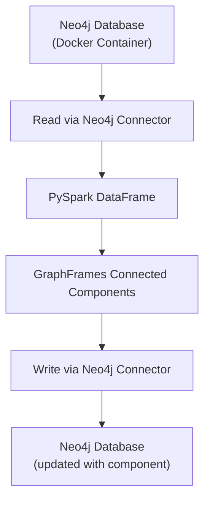
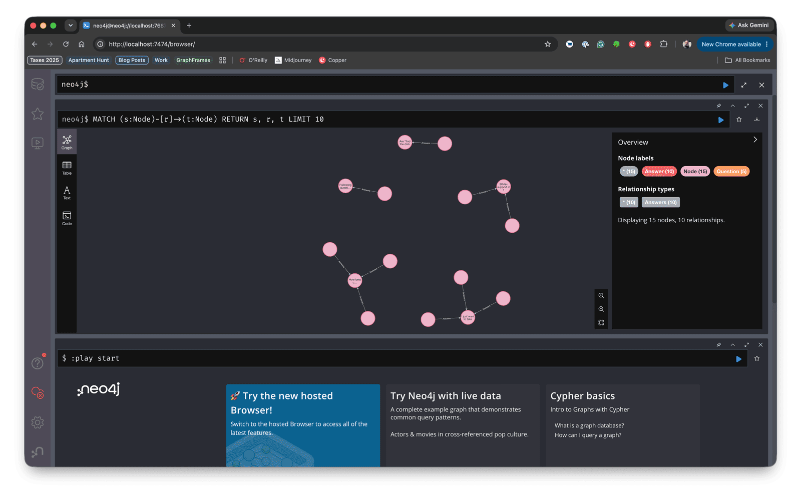

# Neo4j Integration Tutorial

 Apache PySpark Logo -> GraphFrames Logo" />

This tutorial demonstrates how to integrate GraphFrames with Neo4j, enabling you to offload and precompute expensive algorithms like connected components onto Spark where they can scale linearly by taking advantage of Spark's distributed DataFrames. Neo4j + Spark + GraphFrames provides graph database persistence with distributed graph analytics to scale expensive algorithms in a cost effective manner. It can be used with custom Pregel algorithms to implement arbitrary algorithms at scale that would otherwise be expensive or impossible on Neo4j.

In this tutorial we will:

1. Set up Neo4j using Docker
2. Load Stack Exchange data into Neo4j
3. Read graph data from Neo4j into GraphFrames
4. Run distributed graph algorithms (Connected Components)
5. Write enriched results back to Neo4j

This is a complete pipeline for bidirectional data flow between Neo4j and GraphFrames you can use as the basis for many different workflows.

## Why Integrate Neo4j with GraphFrames?

**Neo4j** excels at:

- ACID transactions
- Real-time graph queries
- Complex path traversals
- Interactive graph exploration

Spark **GraphFrames** excels at:

- Distributed graph analytics at scale
- Batch processing of billions of edges
- Integration with Spark ML pipelines
- Complex pattern matching with motif finding

One is a natural complement of the other. GraphFrames can be used to scale expensive algorithms that would be difficult or expensive on Neo4j: **running more cores for expensive analytic algorithms means higher Neo4j license fees**. By contrast, Spark and GraphFrames are free and open source software under the Apache 2.0 License.

## Prerequisites

Before starting, ensure you have:

- **Docker**: For running Neo4j (install from [docker.com](https://www.docker.com/))
- **GraphFrames 0.12+**: `pip install graphframes-py`
- **Apache Spark 4.x+**: Compatible with your Python version
- **Stack Exchange Dataset**: Follow the [Data Setup Tutorial](03-data-setup.md) to download

Check your versions:

```bash
docker --version
```

## Architecture Overview

Our data pipeline:


<!-- markdownlint-disable-next-line -->

## Step 1: Set Up Neo4j with Docker

I have automated the setup and loading of data in Neo4j via a built-in `graphframes neo4j` command so as to present the Neo4j integration as you would might use in practice: reading an existing Neo4j database into PySpark and GraphFrames. First, let's start a Neo4j instance via Docker. We'll use Neo4j Community Edition with APOC plugins for data import capabilities. The `setup` command creates the volume directories, starts the container, and waits until Neo4j actually answers queries:

```bash
graphframes neo4j setup
```

It is safe to re-run, so an existing container is started rather than replaced. `--password`, `--http-port`, `--bolt-port`, `--container-name` and `--heap` are all configurable; When you are finished, [Step 6](#step-6-cleanup) tears it back down: `graphframes neo4j remove`.

To perform these steps manually, just create the folders and start the neo4j container:

```bash
mkdir -p /tmp/neo4j-data/data /tmp/neo4j-data/logs /tmp/neo4j-data/import /tmp/neo4j-data/plugins

docker run -d --name neo4j-graphframes -p 7474:7474 -p 7687:7687 -v /tmp/neo4j-data/data:/data -v /tmp/neo4j-data/logs:/logs -v /tmp/neo4j-data/import:/var/lib/neo4j/import -v /tmp/neo4j-data/plugins:/plugins -e NEO4J_apoc_import_file_enabled=true -e NEO4J_apoc_export_file_enabled=true -e NEO4J_AUTH=neo4j/graphframes123 -e NEO4J_PLUGINS='["apoc"]' -e NEO4J_dbms_memory_heap_initial__size=1G -e NEO4J_dbms_memory_heap_max__size=2G neo4j:community
```

**Connection Details:**

- **Browser UI**: <http://localhost:7474>
- **Bolt Protocol**: neo4j://localhost:7687

Verify Neo4j is running:

```bash
docker logs neo4j-graphframes
```

Wait for the message: `Started.`

You can also visit <http://localhost:7474> and log in with the credentials above.

## Step 2: Download the Stack Exchange Data

See the [Data Setup Tutorial](03-data-setup.md) for instructions on downloading and processing the Stack Exchange data.

This creates two Parquet datasets in the standard GraphFrames shape:

```
python/graphframes/tutorials/data/stats.meta.stackexchange.com/
├── Nodes.parquet          # All node types, one unified schema, with a UUID 'id'
└── Edges.parquet          # All edges: src, dst, relationship
```

Both use a **unified schema**. `Nodes.parquet` carries every column of every node type — a `Badge` row has a `Title` column, it is just null — with a `Type` column naming the type and a UUID `id`. `Edges.parquet` has exactly three columns: `src`, `dst` and `relationship`, where `src`/`dst` are the UUID `id`s from `Nodes.parquet`.

For `stats.meta.stackexchange.com` that is 129,751 nodes:

| Type | Count |
|---|---|
| Badge | 43,029 |
| Vote | 42,593 |
| User | 37,709 |
| Answer | 2,978 |
| Question | 2,025 |
| PostLinks | 1,274 |
| Tag | 143 |

and 97,104 edges:

| relationship | Count | Shape |
|---|---|---|
| Earns | 43,029 | User → Badge |
| CastFor | 40,701 | Vote → Question *or* Answer |
| Tags | 4,427 | Tag → Question *or* Answer |
| Answers | 2,978 | Answer → Question |
| Posts | 2,767 | User → Answer |
| Asks | 1,934 | User → Question |
| Links | 1,180 | Post → Post |
| Duplicates | 88 | Post → Post |

## Step 3: Load Stack Exchange in Neo4j

The `graphframes neo4j load` command creates the the nodes, edges and indices — and prints their verification counts at the end. Point it elsewhere with `--data-dir`, `--site` and the `--neo4j-*` connection options. 

```bash
graphframes neo4j load
```

Then use the [Cypher console](http://localhost:7474/browser/) to query the data at [http://localhost:7474/browser/](http://localhost:7474/browser/):

```cypher
MATCH (s:Node)-[r]->(t:Node)
RETURN s, r, t
LIMIT 10
```

<figure>
    
    <figcaption>Neo4j console lets you easily query Neo4j interactively</figcaption>
</figure>

```cypher
MATCH (:Node)-[r]->(:Node)
RETURN type(r) AS relationship, count(*) AS count
ORDER BY count DESC
```

You should see 129,751 nodes and all 97,104 relationships, matching the tables in Step 2 exactly:

```
+------------+-----+
|relationship|count|
+------------+-----+
|       Earns|43029|
|     CastFor|40701|
|        Tags| 4427|
|     Answers| 2978|
|       Posts| 2767|
|        Asks| 1934|
|       Links| 1180|
|  Duplicates|   88|
+------------+-----+
```

Because both loads MERGE, running the whole thing a second time produces these same numbers rather than doubling them.

> **Note:** `cypher()` uses the connector's `query` option, which rewrites your query to partition it. That means it rejects a trailing `SKIP`/`LIMIT` — take the top N with `DataFrame.limit()` instead of in Cypher.

## Step 4: Import the Graph from Neo4j in Spark / GraphFrames

Everything from here is `python/graphframes/tutorials/neo4j.py`. It needs both the GraphFrames and the Neo4j connector jars on the classpath, so run it with `spark-submit`:

```bash
spark-submit --packages io.graphframes:graphframes-spark4_2.13:0.12.1,org.neo4j:neo4j-connector-apache-spark_2.13:6.0.0_for_spark_4 python/graphframes/tutorials/neo4j.py
```

On Spark 3.5, use `graphframes-spark3_2.13:0.12.1` and `6.0.0_for_spark_3`. Both coordinates must agree on the Spark major version — a Spark 3 GraphFrames jar will not load beside a `for_spark_4` connector.

The script opens with the same connection settings the loader used, and the same shared label:

```python
import pyspark.sql.functions as F
from pyspark.sql import DataFrame, SparkSession

from graphframes.pg import EdgePropertyGroup, PropertyGraphFrame, VertexPropertyGroup

NEO4J_FORMAT = "org.neo4j.spark.DataSource"

NEO4J = {
    "url": "neo4j://localhost:7687",
    "authentication.basic.username": "neo4j",
    "authentication.basic.password": "graphframes123",
    "database": "neo4j",
}

LABEL = "Node"
PARTITIONS = 8

# The eight relationship types `graphframes neo4j load` creates - see the tables above.
RELATIONSHIP_TYPES = ["Earns", "CastFor", "Tags", "Answers", "Posts", "Asks", "Links", "Duplicates"]

spark = SparkSession.builder.appName("Neo4j + GraphFrames").getOrCreate()
# Connected Components checkpoints as it iterates, so Spark needs somewhere to put them.
spark.sparkContext.setCheckpointDir("/tmp/graphframes-checkpoints/neo4j")
```

### Query Neo4j from PySpark

```python
def cypher(query: str, count_query: str = "") -> DataFrame:
    reader = spark.read.format(NEO4J_FORMAT).options(**NEO4J).option("query", query)
    if count_query:
        reader = reader.option("query.count", count_query).option("partitions", str(PARTITIONS))
    return reader.load()
```

A `query` read is **single-partition** unless you tell the connector how many rows to expect. The two big reads below pass a `count_query` and get `PARTITIONS` workers; the small verification queries at the end leave it off, where one partition is fine.

> **Note:** the connector rewrites a `query` read in order to partition it, so it rejects a trailing `SKIP`/`LIMIT`. Take the top N with `DataFrame.limit()` instead of in Cypher.

### Model the Graph as a PropertyGraphFrame

Neo4j's `:Node` label covers seven Stack Exchange node types and eight relationship types (see Step 2 and Step 3 above). Reading all of that into one untyped vertex DataFrame and one untyped edge DataFrame — then handing both straight to `GraphFrame` — throws away that structure the moment it leaves Neo4j. A [`PropertyGraphFrame`](../04-user-guide/11-property-graphs.md) keeps it: one `VertexPropertyGroup` for the nodes, and one `EdgePropertyGroup` per relationship type. Cypher aliases do the rest — return columns named `id`, `Type`, `src`, `dst` and `relationship`, and the DataFrames arrive in exactly the shape the property groups want.

```python
vertices = cypher(
    f"MATCH (n:{LABEL}) RETURN n.id AS id, n.Type AS Type",
    f"MATCH (n:{LABEL}) RETURN count(n) AS count",
).cache()
edges = cypher(
    f"MATCH (s:{LABEL})-[r]->(t:{LABEL}) "
    "RETURN s.id AS src, t.id AS dst, type(r) AS relationship",
    f"MATCH (:{LABEL})-[r]->(:{LABEL}) RETURN count(r) AS count",
).cache()

# ids are already globally-unique UUIDs, so there is no need to mask/hash them.
nodes_group = VertexPropertyGroup("nodes", vertices, "id", apply_mask_on_id=False)
edge_groups = [
    EdgePropertyGroup(
        relationship,
        edges.filter(F.col("relationship") == relationship).select("src", "dst"),
        nodes_group,
        nodes_group,
        is_directed=True,
        src_column_name="src",
        dst_column_name="dst",
    )
    for relationship in RELATIONSHIP_TYPES
]
property_graph = PropertyGraphFrame([nodes_group], edge_groups)
```

Matching on `:Node` — the shared label, not the type labels — is what makes the two Cypher reads above cover every node and every relationship in the graph, instead of one query per type. Splitting `edges` eight ways afterwards costs nothing extra in Neo4j: it is one cached DataFrame, filtered locally by Spark. Both reads are cached because they are each read more than once below — `edges` once per relationship type, `vertices` again after Connected Components runs.

### Project, Validate and Count

`to_graphframe()` never hands you the whole property graph implicitly — you always name the vertex and edge property groups you want, which doubles as documentation: this call says exactly which parts of the Stack Exchange graph feed the algorithm that follows. Connected Components is meant to answer "how does the *whole* graph connect", so this projection includes every group; a narrower question — say, how users, questions and answers connect through content alone — would instead pass `edge_property_groups=["Asks", "Posts", "Answers"]` and leave `CastFor` (votes) and `Earns` (badges) out.

```python
graph = property_graph.to_graphframe(
    vertex_property_groups=["nodes"], edge_property_groups=RELATIONSHIP_TYPES
)
graph.validate()
print(f"Vertices: {graph.vertices.count():,}   Edges: {graph.edges.count():,}")
```

`validate()` checks the two things that would otherwise fail silently or blow up mid-algorithm: no duplicate vertex ids, and no edge pointing at a vertex that does not exist. Both are cheap to check up front and expensive to debug from a Connected Components stack trace.

### Run Connected Components

Connected Components is the kind of expensive, iterative algorithm over an entire graph that is well suited to Spark's distributed compute. GraphFrames treats edges as undirected here, so a component is a set of nodes reachable from one another by any path.

```python
components = (
    graph.connectedComponents(algorithm="graphframes")
    .join(vertices, "id")
    .select("id", "Type", "component")
    .cache()
)
print(f"Components found: {components.select('component').distinct().count():,}")

largest = components.groupBy("component").count().orderBy(F.desc("count")).first()["component"]
print("The largest component, by node type:")
components.filter(F.col("component") == largest).groupBy("Type").count().orderBy(
    F.desc("count")
).show()
```

`to_graphframe()` only carries `id` and `property_group` on its vertices — a projection's other columns are left behind on purpose, since most algorithms do not need them. `connectedComponents()` adds `component` to that; joining back onto `vertices` on `id` is what brings `Type` back for the breakdown below.

On `stats.meta.stackexchange.com` this finds **40,115 components**, and the distribution is the interesting part: one giant component holds 56,442 nodes — the connected core of the site — and everything else is tiny. Breaking that core down by type shows what it's made of:

```
+--------+------+
|    Type| count|
+--------+------+
|    Vote|40,700|
|   Badge| 9,836|
|  Answer| 2,978|
|Question| 2,024|
|    User|   771|
|     Tag|   133|
+--------+------+
```

Only 771 of 37,709 users are in it. The long tail is accounts that registered, earned an automatic badge, and never posted or voted — each one its own little island. That is a real finding about the site, and it is exactly the kind of question that is painful to answer with a traversal query and natural to answer with a distributed algorithm.

## Step 5: Write the Results Back to Neo4j

Send only the key and the new property. The connector writes every column it is given, so a wider DataFrame means rewriting properties Neo4j already has.

```python
(
    components.select("id", "component")
    .write.format(NEO4J_FORMAT)
    .options(**NEO4J)
    .mode("Overwrite")
    .option("labels", f":{LABEL}")
    .option("node.keys", "id")
    .save()
)
```

This is an upsert, and three separate things make it one:

- **`Overwrite` means MERGE.** The connector maps Spark's save modes onto Cypher: `Overwrite` becomes a `MERGE` on `node.keys`, `Append` a bare `CREATE`. Because every `id` here already exists, the MERGE matches rather than creates, and sets `component` **in place** — no new nodes, no dropped type labels, no disturbance to the properties loaded in Step 3.
- **`:Node` alone, not `:Node:Question`.** Matching the shared label means this one write updates every node type at once.
- **The constraint from Step 3.** Without the uniqueness constraint on `:Node(id)`, each of the 129,751 MERGEs would scan every `:Node` in the database looking for its match. With it, each one is an index lookup. This is the whole reason `graphframes neo4j load` creates the constraint before it writes anything.
- **SKIP/LIMIT are not allowed at the end of the query.** The connector rewrites `query` reads to partition them. Use `DataFrame.limit()` instead. When you read via .option("query", ...), the connector doesn't run your Cypher verbatim. It treats it as a template and appends its own pagination clauses so it can split the read across Spark partitions:

Now ask a question that mixes the property graph with the result Spark just computed:

```python
print("Most decorated users in the largest component:")
cypher(
    f"MATCH (u:User)-[:Earns]->(b:Badge) WHERE u.component = {largest} "
    "RETURN u.DisplayName AS user, count(b) AS badges ORDER BY badges DESC"
).limit(10).show(truncate=False)

spark.stop()
```

```
+---------------------------+------+
|user                       |badges|
+---------------------------+------+
|whuber                     |249   |
|gung - Reinstate Monica    |220   |
|Glen_b                     |217   |
|amoeba                     |129   |
|Tim                        |119   |
+---------------------------+------+
```

`u.component` came from Spark; `[:Earns]->(b:Badge)` came from Neo4j. All 129,751 nodes now carry a `component`, queryable alongside everything else — in the browser, from Cypher, or from an application. That is the round trip: Neo4j stored the graph, Spark did the work that does not fit on one machine, and Neo4j got the answer back.

## Step 6: Cleanup!

When you are done, remove the container and its data:

```bash
graphframes neo4j remove
```

To do it by hand:

```bash
docker rm -f neo4j-graphframes && rm -rf /tmp/neo4j-data
```

## Troubleshooting

**The load finished but there are no relationships.** The endpoint labels in `relationship.source.labels` / `relationship.target.labels` do not match any node. With `save.mode = Match` the connector skips unmatched endpoints silently. Confirm what your nodes actually carry:

```bash
docker exec neo4j-graphframes cypher-shell -u neo4j -p graphframes123 "CALL db.labels();"
```

**Node counts are an exact multiple of what you expect.** A previous run used `.mode("Append")`, which is `CREATE` and ignores `node.keys`. `MERGE` cannot repair this afterwards — the duplicates have distinct internal ids and none of them carry the label the fixed script MERGEs on, so re-running adds another copy rather than collapsing them. Reset and reload:

```bash
docker exec neo4j-graphframes cypher-shell -u neo4j -p graphframes123 "MATCH (n) CALL (n) { DETACH DELETE n } IN TRANSACTIONS OF 10000 ROWS;"
```

Or start over from scratch:

```bash
graphframes neo4j remove --yes && graphframes neo4j setup && graphframes neo4j load
```

**`key not found: ArrayType(StringType,true)`.** Connector 6.0.0's schema-optimization code cannot map array columns. Do not pass `schema.optimization.node.keys` on a write whose DataFrame contains one; create the constraint up front on an empty DataFrame, as in Step 3.

**`TransientException` mentioning a deadlock wait cycle.** Concurrent partitions are contending for the relationship-group lock of a dense node. Write relationships from a single partition, or repartition so no two partitions touch the same dense node.

## Next Steps

- Swap `connectedComponents()` for [PageRank](../04-user-guide/03-centralities.md) or [Label Propagation](../04-user-guide/06-graph-clustering.md) and write those results back the same way
- Project a narrower graph — e.g. `edge_property_groups=["Asks", "Posts", "Answers"]` — to see how the site's *content* connects on its own, without votes or badges pulling everything into one giant component
- Use [motif finding](02-motif-tutorial.md) to search for patterns that Cypher expresses awkwardly, then persist what you find. Then run another motif including that field!
- Point `graphframes neo4j load --site` at a larger site :)
