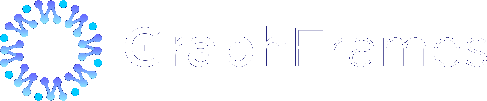

<meta itemprop="datePublished" content="2025-08-26T12:00:00">
<meta itemprop="summary" content="GraphFrames is back: new contributors, new logo, new documentation, new Spark Connect support, and more!">
<meta itemprop="authors" content="Russell Jurney">

# GraphFrames is back!

*Originally published in the [Graphlet Ai Blog](https://blog.graphlet.ai/graphframes-is-back-with-v0-9-2-5773d55d3291)*

GraphFrames 0.9.2 is out on [PyPi](https://pypi.org/project/graphframes-py/) as [graphframes-py](https://pypi.org/project/graphframes-py/) and as [io.graphframes](https://central.sonatype.com/namespace/io.graphframes) on [Maven Sonatype Central](https://central.sonatype.com/search?q=io.graphframes)! Documentation is now available on [graphframes.io](https://graphframes.io/)… and we even have a new logo!

    <figure>
        
        <figcaption>
            The new GraphFrames logo is new for this release :)
        </figcaption>
    </figure>

## GraphFrames is BACK!

You can see below that GraphFrames is back! It has seen contributions every week for most of the year — we have half a dozen active contributors now. This release is due to the efforts of many people but I need to express our deep gratitude to [Sem Sinchenko](https://www.linkedin.com/in/semyon-a-sinchenko/), who drove this release.

    <figure>
        
        <figcaption>
            The new GraphFrames logo is new for this release
        </figcaption>
    </figure>

The project has gone from *effectively dead* to *vibrant* in the six months since [GraphX was deprecated](https://lists.apache.org/thread/qrvo6xrt8zvp5ss73z5spt9q89r0htwo) from Spark, which prompted us to get to work on an all-DataFrame replacement. You can see in the chart below that there is more frequent contributions than since the project’s inception!

    <figure>
        
        <figcaption>
            After a six year gap in additions, GraphFrames is back with Spark Connect support!
        </figcaption>
    </figure>

## New Features in GraphFrames 0.9.2

It was necessary for GraphFrames to support both Spark 4 and Spark Connect to remain integral to the Spark community. There were many issues resolved in the release, but the core of it was:

- [Spark Connect support](https://github.com/graphframes/graphframes/pull/506)
- [Spark 4.x support](https://github.com/graphframes/graphframes/pull/608)
- [Performance improvements in Connected Components](https://github.com/graphframes/graphframes/pull/552)
- [Updated API for Pregel](https://github.com/graphframes/graphframes/issues?q=is%3Aissue+state%3Aclosed+Pregel)
- DataFrame implementation of [LabelPropagation](https://graphframes.io/api/scaladoc/org/graphframes/lib/LabelPropagation.html), GraphX-free
- DataFrame implementation of [ShortestPaths](https://graphframes.io/api/scaladoc/org/graphframes/lib/ShortestPaths.html), GraphX-free
- [New groupId](https://central.sonatype.com/namespace/io.graphframes) `io.graphframes`
- [New PyPi ID](https://pypi.org/project/graphframes-py/): `graphframes-py`
- A new website: [graphframes.io](https://graphframes.io/) with [Updated documentation](https://graphframes.io/)
- A new [Network Motif Finding Tutorial](/03-tutorials/02-motif-tutorial.md)
- [A lot of additional changes and fixes](https://github.com/graphframes/graphframes/releases/tag/v0.9.0)

## State of the Union

The GraphFrames community has achieved our first goal: make the project viable again! Still in the future?

## Property Graphs

Sem has [started implementing](https://github.com/graphframes/graphframes/pull/613) Property Graphs for GraphFrames, which currently has `relationship` for edges but not `type` for nodes. In current practice, this means property graph processing requires you to merge all your node schemas together into a kitchen sink schema before using GraphFrames’ algorithms. it is a real drag… property graphs will be a huge improvement! Sem recently [outlined a beautiful vision](https://semyonsinchenko.github.io/ssinchenko/post/dreams-about-graph-in-lakehouse/) for property graphs as part of the Open Lakehouse. Check it out!

## Inclusion in Spark

This is actively debated: it would be a lot of trouble to release with Spark, but based on the number of search hits for [GraphX](https://www.google.com/search?q=GraphX) versus [GraphFrames](https://www.google.com/search?q=GraphFrames), it would get us 10x as many users. When I put that way, GraphFrames in Spark sounds pretty good!

## GraphX is Deprecated

Spark deprecating GraphX was the call to action that led us to revive GraphFrames, and we heard it well. We’re building DataFrame implementations of all GraphX components. GraphX has already been removed from ShortestPaths and from LabelPropagation. The rest of the work is being tracked here and is underway. GraphX will be deprecated from GraphFrames as of 1.0. GraphFrames 2.0 will remove GraphX completely. Soon GraphFrames will be entirely built on DataFrames!